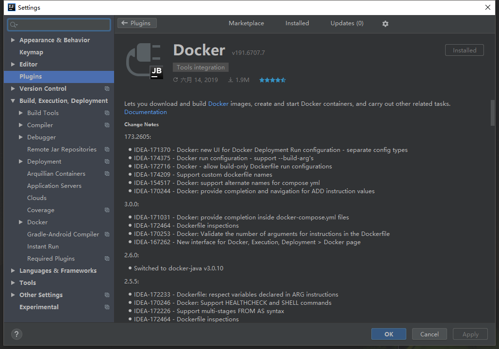
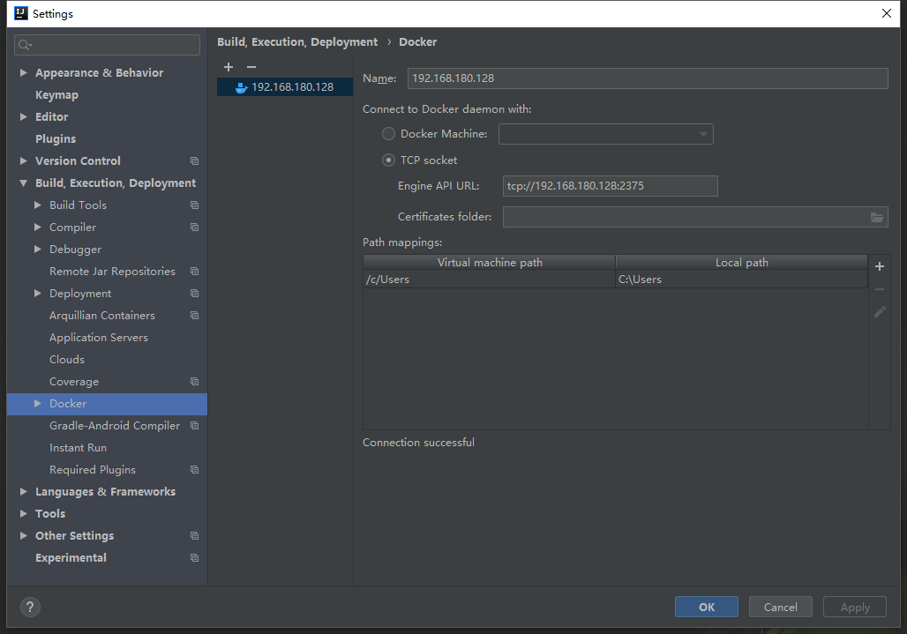
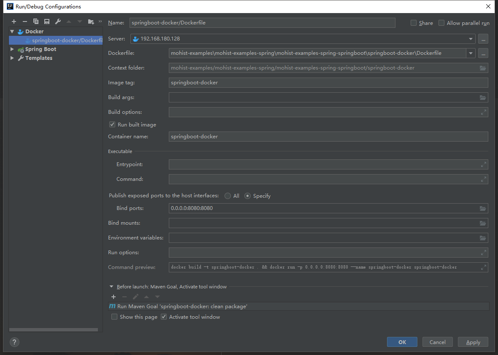

# SPRING-BOOT-DOCKER

## IntelliJ IDEA 部署springboot 到远程 docker服务器

1. idea 安装 docker 插件
   

2. 设置将要远程连接的docker服务器地址
   

3. 项目根目录下编写Dockerfile文件

   ```
   # 指定基础镜像，在其上进行定制
   FROM java:8
   
   # 维护者信息
   MAINTAINER kuhnwei <email@kuhnwei.com>
   
   VOLUME /app
   
   ADD /target/mohist.jar app.jar
   
   RUN bash -c "touch /app.jar"
   
   EXPOSE 8080
   
   ENTRYPOINT ["java", "-jar", "app.jar"]
   ```

4. 运行配置
   
   其中，记得配置运行前提 先通过maven进行项目打包。

最后成功运行


