# Docker

## Docker简介

Docker是这几年比较热门的话题，Doker也是一种云开发的技术，而随着技术的不断前进，以后“架构师 + 云服务”将成为高级人才的标准了。

在进一步分析Docker用法之前首先来思考一个问题：

- 如果要想进行项目的生产环境部署传统的做法可能是这样进行处理的：
  - 开发者自己的电脑上有一套完整的运行环境配置，包括：JDK、开发工具、Tomcat、MySQL等；
  - 项目如果要进行上线部署，那么会由开发者自觉将程序打成一个war文件包，而后将这个war文件交给运维；

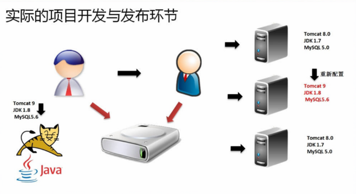

在整个的项目之中只有开发人员最清楚项目的运行环境，也是唯一能够将运行环境设置与该项目无缝衔接的最好的使用者。

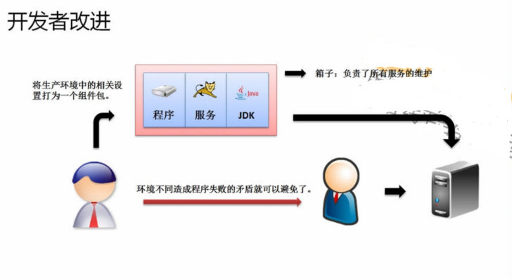

将所需要的服务信息打包成一个组件或者多个组件，并且将这些组件直接发布给运维人员，运维人员不需要做出任何的修改，直接将组件安装到服务器上，并且去启动相应的服务，就可以进行服务的上线处理了。

正是在这样的环境下，才产生了Docker开发环境。

**Docker**是一个开源的应用容器引擎，让开发者可以打包它们的应用以及依赖包到一个可移植的容器中，然后发布到任何流行的Linux机器上，也可以实现虚拟化，容器是完全使用沙箱机制，相互之间不会有任何接口。一个完整的Docker有以下几个部分组成：

- DockerClient客户端；
- Docker Daemon守护进程；
- Docker Image镜像；
- DockerContainer容器。

如果现在要将所有的服务都设置到了Docker镜像之中，那么就意味着你可以在一台主机上启动若干个Docker，如果现在主机的性能很庞大，那么就可以利用Docker做出一台主机的服务拆分。

Docker的设计非常强大，可以在几乎所有的操作系统上进行运行，只需要获取相应的开发包即可。如果要使用强烈建立最好使用Mac版、Linux版、Unix版。

如果要想获取Docker开发环境，那么可以通过如下几个命令完成：

- 为了保证你的Docker运行环境正常，一定要先进行系统更新：apt-get update;
- 通过ubuntu的网址下载Docker工具组件包：apt-get -y install docker.io;
  - 需要保证ubuntu系统内核应该是在4.x以上：uname -r；
- 如果要想启动Docker，可以执行：systemctl start docker;
- 如果现在希望Docker可以随系统一起启动，啧可以执行：systemctl enable docker;

## Docker架构

如果要想使用Docker进行服务的配置与部署，那么首先需要对Docker运行环境和运行架构有一个了解，我们在之前所下载的Docker严格意义上来讲只是一个工作平台，就好比Eclipse是一个开发平台。

Docker如果要想使用则需要通过DockerHub获取一个基础的镜像信息，而后在这个镜像上进行服务的配置，随后将新的镜像进行保存，并且交付运维人员进行镜像的部署，所以客户端与服务端都一定要保留有Docker运行环境。

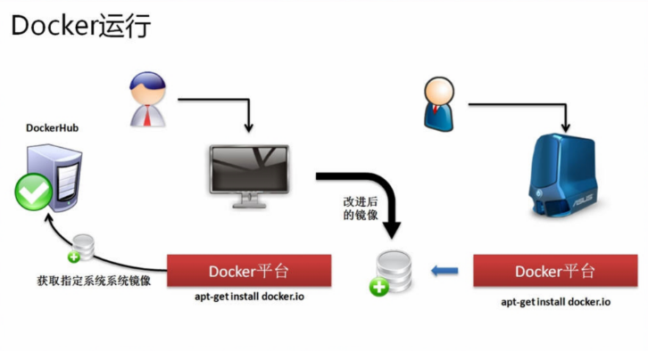

- Docker使用客户端-服务器（C/S）架构模式，使用远程API来管理和创建Docker容器；

- Docker容器通过Docker镜像来创建；

- 容器与镜像的关系类似于面向对象编程中的对象与类：

  - Docker镜像 = 类；
  - Docker容器 = 对象。

  一个Docker镜像可以同时启动多个容器。

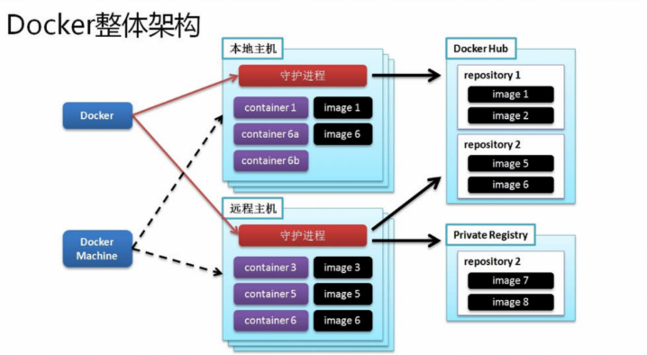

**Docker架构组成**

| No.  |          组成           | 描述                                                         |
| :--: | :---------------------: | :----------------------------------------------------------- |
|  1   |  Docker镜像（Images）   | Docker镜像是用于创建Docker容器的模板。                       |
|  2   | Docker容器（Container） | 容器是独立运行的一个或一组应用。                             |
|  3   | Docker客户端（Client）  | Docker客户端通过命令行或者其他工具使用[Docker API](https://docs.docker.com/reference/api/docker_remote_api)与Docker的守护进程通信。 |
|  4   |   Docker主机（Host）    | 一个物理或者怩的机器用于执行Docker守护进程和容器。           |
|  5   | Docker仓库（Registry）  | Docker仓库用来保存进项，可以理解为代码控制中的代码仓库。[Docker Hub](https://hub.docker.com)提供了庞大的镜像集合供使用。 |
|  6   |     Docker Machine      | Docker Machine是一个简化Docker安装的命令行工具，通过一个简单的命令行即可在相应的平台上安装Docker，比如VirtualBox、Digital Ocean、Microsoft Azure。 |

## Docker配置与应用

现在已经获得了Docker工具，那么下面就可以直接利用这个工具通过DockerHub上抓取基础的镜像，而后根据这个基础镜像进行使用，本次使用的镜像依然为ubuntu。

### Docker界的“Hello World”

在Linux下有一个命令：echo，这个命令的主要特征是可以进行数据的回显操作：

```
/bin/echo www.mohist.site
/bin/echo "Hello World"
```

所有Docker的使用命令都是使用docker开头，如果要想运行Docker镜像（会产生Docker容器），那么执行如下命令：

```
docker run ubuntu /bin/echo "Hello World"
```

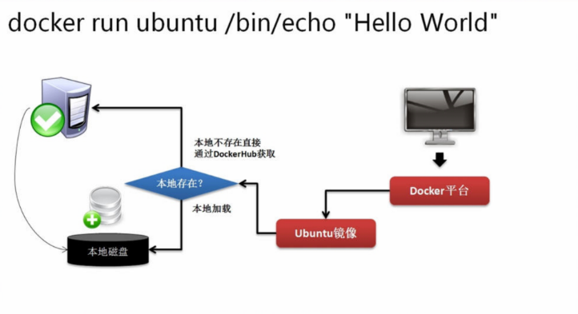

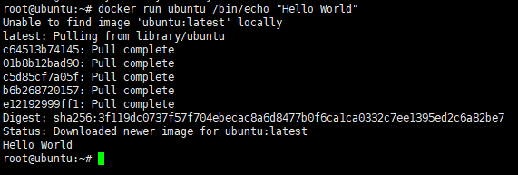

以上的操作知识通过docker命令获取了镜像，并且执行了镜像之中的程序文件，不过我们还是无法感受到Docker容器的存在，那么下面可以考虑进入到容器之中：

```
docker run -i -t ubuntu
docker run -it ubuntu
```

此时就表示进入到了docker之中，那么这个时候会给出一个编号“496c9390f640”，那么这个编号就表示一个容器的编号，也就是说该容器的唯一编号信息。

那么以上两个执行的参数的作用如下：

- "i": 在新容器之中制定一个终端：
- "t": 允许直接对容器内的终端进行交互操作处理。

如果说现在要想退出使用的终端则可以使用“CTRL + D”进行终端的使用退出，退出之后，还可以通过docker给出的命令查看当前正在运行的容器：

```
docker ps
```

如果要想查询详细的docker进程信息，则可以使用`docker ps -a`的参数来运行。

### Docker镜像

在整个Docker组成之中镜像是一个核心的话题，那么只要存在有镜像就可以进行容器的处理操作了。现在主机上已经下载了一个ubuntu进项，通过如下命令查看：

```
docker images
```

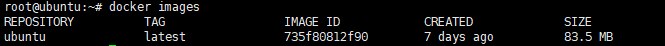

在docker之中本身提供有镜像信息的查询功能，如果要想查询镜像，则可以使用search指令完成：

```
docker search ubuntu
docker search ubuntu:15
```

**范例：**抓取“mperzl/ubuntu-core-15.10”镜像信息

```
docker pull mperzl/ubuntu-core-15.10
```

执行之后将进入到一个下载的处理过程。下载完成之后可以继续查看所有的镜像信息`docker images`，也可以直接进入到一个docker镜像中启动容器：

```
// TODO 没有启动成功
docker run -it mperzl/ubuntu-core-15.10
```

现在已经下载了Docker镜像，按照之前所解释的那样，对于docker的镜像本地用户有可能会进行更改，所以现在如果要进行更改，那么久需要对镜像进行保存处理。

1. 进入到ubuntu镜像：`docker run -it buntu`;

2. 在镜像之中要对该镜像中的内容进行更新：`apt-get update`;

3. 随后可以对该容器的操作进行提交处理，但是提交前请先不要退出容器：

   ```
   docker commit -m="mohist-image" -a="kuhnwei" [容器ID] mohist/ubuntu:base
   docker commit -m="mohist-image" -a="kuhnwei" 
   ```

   几个参数的作用：

   1. "-m": 表示进行说明的定义：
   2. "-a": 表示作者；

   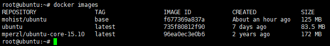
   随后退出之前的容器，并且再次登录自己新创建的镜像文件：`docker run -it mohist/ubuntu:base`。

### Docker容器

Docker镜像准备完成之后下面就需要进行容器的配置了，本次可以简化一些配置，可以直接在容器之中进行JDK与Tomcat的安装处理。

1. 【外部主机】现在Docker镜像里面并没有ftp服务安装，那么这个时候你就可以选择通过网络下载，如果说现在本地已经有了安装包，那么可以直接利用命令，通过外部系统拷贝到Docker容器之中；

2. 【外部主机】通过外部主机拷贝开发包到容器之中：

   1. 【外部主机】首先进行容器的启动：`docker run -it mohist/ubuntu:base`;
   2. 【外部主机】将jdk拷贝到容器中：`docker cp /usr/local/jdk-8u101-linux-x64.tar.gz e929cf560f8e:/usr/local/`;
   3. 【外部主机】将Tomcat拷贝到容器中：`docker cp /usr/local/apache-tomcat-8.5.23.tar.gz e929cf560f8e:/usr/local/`;

3. 【Docker容器】可以查看一下在“/usr/local”目录之中是否存在有两个开发包，如果拷贝成功是可以看见的；

4. 【Docker容器】将jdk解压缩到“/usr/local/”目录中：

   ```
   tar xzvf jdk-8u101-linux-x64.tar.gz -C /usr/local
   ```

5. 【Docker容器】将Tomcat解压缩到"/usr/local/"目录中；

   ```
   tar xzvf apache-tomcat-8.5.23.tar.gz -C /usr/local
   ```

6. 【Docker容器】为了放屁进行配置，可以直接进行目录的更名处理：

   1. 更名jdk所在目录：`mv jdk1.8.0_101/ jdk1.8`;
   2. 更名Tomcat所在目录：`mv apache-tomcat-8.5.23 tomcat`;

7. 【Docker容器】修改环境属性文件（这次修改不会被保留）：

   1. 下载vi命令：apt-get -y install vim;

   2. 打开环境配置文件：vim /etc/profile;

   3. 追加新的环境属性想：

      ```shell
      export JAVA_HOME=/usr/local/jdk1.8
      export PATH=$PATH:$JAVA_HOME/bin:
      ```

   4. 让配置立即生效：source /etc/profile;

8. 【Docker容器】修改Tomcat配置文件，追加JAVA_HOME、JRE_HOME;

   1. 打开配置文件：vim /usr/local/tomcat/bin/setclasspath.sh;

   2. 增加如下配置项：

      ```shell
      export JAVA_HOME=/usr/local/jdk1.8
      export JRE_HOME=/usr/locla/jdk1.8/jre
      ```

9. 【外部主机】此时已经对容器做出了修改，那么下面就需要进行提交处理：

   ```
   docker commit -m "mohist-image-tomcat" -a="kuhnwei" e929cf560f8e mohist/ubuntu-tomcat:base
   ```

   提交之后可以再次查看镜像信息：docker images；

   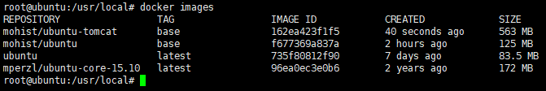

10. 如果现在直接在内部的Docker中启动Tomcat，那么这个Tomcat是无法使用的。之所以无法使用，是因为没有做一个Docker的端口映射。

11. 【外部主机】退出当前容器，一旦退出之后你的环境属性就废了，随后设置一个映射端口：

    ```
    docker run -p 80:8080 -it mohist/ubuntu-tomcat:base
    ```

12. 【Docker主机】随后重新启动Tomcat服务：`/usr/local/tomcat/bin/catalina.sh start`

    - 此时访问外部主机：http://192.168.68.129/，改访问时通过Docker做得一个端口映射；

13. 【Docker主机】如果此时你执行“CTRL + D”一旦退出服务就停止了，如果不希望服务停止，则可以使用“CTRL + P + Q”的组合让其在后台继续执行；

## Docker镜像管理

当已经配置完成了一个Docker之后，那么该配置的镜像一定要给运维人员进行部署处理操作，所以为了能够部署就一定需要将Docker镜像保存下来，那么对于Docker镜像的保存有两种模式：直接利用文件保存、DockerHub保存。

### 通过文件保存Docker镜像

首先在给出的Docker命令之中已经提供有一个save指令，这个指令可以实现镜像文件的写入处理。

**范例：**将“mohist/ubuntu”镜像保存到“/usr/local"目录中：mohist.base

```
docker save -o /usr/local/mohist.base mohist/ubuntu:base
```

如果要下载镜像可以直接设置权限“chmod 777 /usr/local/mohist.base”

此时如果已经存在有镜像之后，那么就可以直接进行镜像文件的导入。

**范例：**删除掉已有的镜像信息

```
docker rmi mohist/ubuntu:base
```

如果此时该镜像依然有容器正在运行，那么在删除的时候出现如下错误信息：

```
Error response from daemon: conflict: unable to remove repository reference "mohist/ubuntu:base" (must force) - container e929cf560f8e is using its referenced image f677369a837a
```

这个时候需要查看下是否有运行的容器，而后结束容器运行后再删除：使用“docker ps”发现有容器在运行，那么需要介绍容器的执行：

- 停止正在运行的容器：docker stop f619570d144e
- “docker ps”指令只能够查询所有前台运行的容器，如果要查询后台的容器“docker ps -a”指令完成；
- 结束一个容器的执行：docker rm f619570d144e
- 结束全部的后台运行的Docker容器：docker rm \`docker ps -a -q\`;
  - 取得全部容器的ID：docker ps -a -q
- 继续删除镜像的命令：docker rmi mohist/ubuntu:base

**范例：**现在已经没有了之前导出的镜像了，则需要进行镜像文件的导入处理

```
docker load --input /usr/local/mohist.base
```

随后再一次查询所哟逇Docker镜像。

### DockerHub

很明显更将所有的Docker镜像以文件的形式出现严格来讲是不方便维护的，同事也考虑到共享的概念，那么久在Docker设计的时候提供一个DockerHub的站点（hub.docker.com），这个站点可以直接进行Docker镜像的存储。

**范例：**将当前的“mohist/ubuntu:base”上传到DockerHub之中

- 在上传之前你需要进行一个登陆的处理操作：docker login；

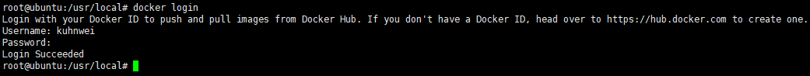

```
docker push mohist/ubuntu:base
```

如果遇到上传遇到如下的错误

```
denied: requested access to the resource is denied
```

表示登陆的用户名和将要上传的镜像名不同，因此没有权限上传。需要修改镜像名字（斜线前的名字必须要和DockerHub的用户名相同）

```
# 修改镜像名字
docker tag mohist/ubuntu:base kuhnwei/ubuntu:base
# 重新上传
docker push kuhnwei/ubuntu:base
```

如果此时镜像推送成功了，那么久可以直接进行下载。

**范例：**下载镜像

```
docker pull kuhnwei/ubuntu:base
```

你可以自己再去删除已有的镜像，而后重新下载新的镜像。

### 构建Docker镜像

现在发现所有的镜像操作都是直接下载了一个已有的镜像，而后进行镜像的配置，再提交处理，但是除了这样的处理模式之外，还可以直接利用Docker的命令通过一个脚本来执行镜像的创建，但是镜像的创建也有一个前提：必须要有一个基础镜像。那么下面还是结合Docker，创建一个包含有JDK与Tomcat的镜像处理过程。

1. 镜像里面需要有一个程序包的获取问题，那么就必须通过一个站点下载；

   - [JDK的下载地址](http://download.oracle.com/otn-pub/java/jdk/8u181-b13/96a7b8442fe848ef90c96a2fad6ed6d1/jdk-8u181-linux-x64.tar.gz)
   - [Tomcat的下载地址](http://mirror-hk.koddos.net/apache/tomcat/tomcat-8/v8.5.32/bin/apache-tomcat-8.5.32.tar.gz)

2. 本次使用“ubuntu”镜像作为基础镜像，这个时候就需要将所有的操作步骤变为脚本文件，那么这个脚本文件的名称应该为Dockerfile；

3. 编写Dockerfile配置文件；

   ```dockerfile
   # 找到一个基础的镜像
   FROM ubuntu
   # 需要设置一个镜像的说明文件，以及设置作者的信息
   MAINTAINER mohist "email@kuhnwei.com"
   # 镜像下载完成之后都需要进行更新处理
   RUN apt-get update
   # 下载wget组件，这样就可以通过本地服务器进行指定软件的下载
   RUN apt-get -y install wget
   
   # 要进行JDK的配置，既然要进行JDK配置就㤇为其设置一个下载目录
   # 启动JDK的下载操作指令
   RUN cd /tmp && wget --no-cookies --no-check-certificate --header "Cookie: gpw_e24=http%3A%2F%2Fwww.oracle.com%2F; oraclelicense=accept-securebackup-cookie" "http://download.oracle.com/otn-pub/java/jdk/8u181-b13/96a7b8442fe848ef90c96a2fad6ed6d1/jdk-8u181-linux-x64.tar.gz"
   # 下载完成之后需要对开发包进行解压缩控制，解压缩到/usr/local/目录
   RUN tar xzvf /tmp/jdk-8u181-linux-x64.tar.gz -C /usr/local
   # 需要为解压缩后的目录进行更名处理
   RUN mv /usr/local/jdk1.8.0_181 /usr/local/jdk
   # 需要在环境的属性之中追加有JDK配置
   ENV JAVA_HOME /usr/local/jdk
   ENV PATH $PATH:$JAVA_HOME/bin
   
   # 下面要进行Tomcat的安装与配置
   RUN cd /tmp && wget http://mirror-hk.koddos.net/apache/tomcat/tomcat-8/v8.5.32/bin/apache-tomcat-8.5.32.tar.gz
   RUN tar xzvf /tmp/apache-tomcat-8.5.32.tar.gz -C /usr/local/
   RUN mv /usr/local/apache-tomcat-8.5.32 /usr/local/tomcat
   
   # 映射端口
   EXPOSE 8080
   ```

4. 去运行Docker镜像的构建脚本：

   ```
   docker build -t mohist/ubuntu-test:dev /usr/local/
   ```

   这样就相当于用命令构建好了一个Docker镜像操作了。

   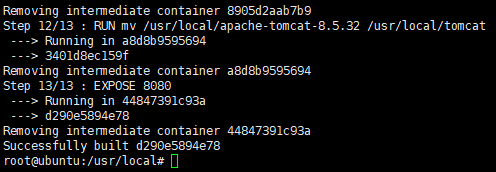

