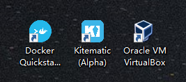
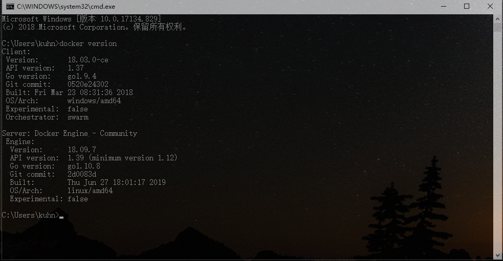
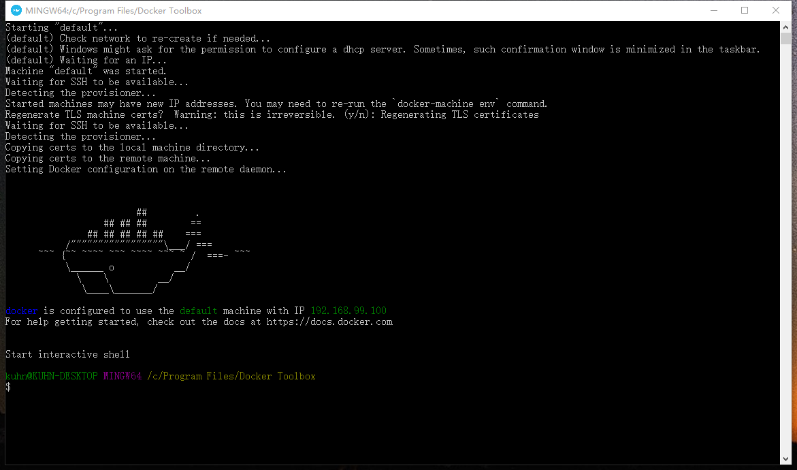
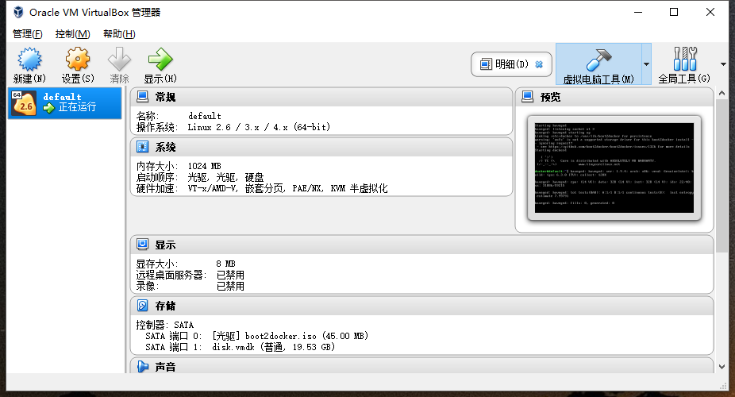
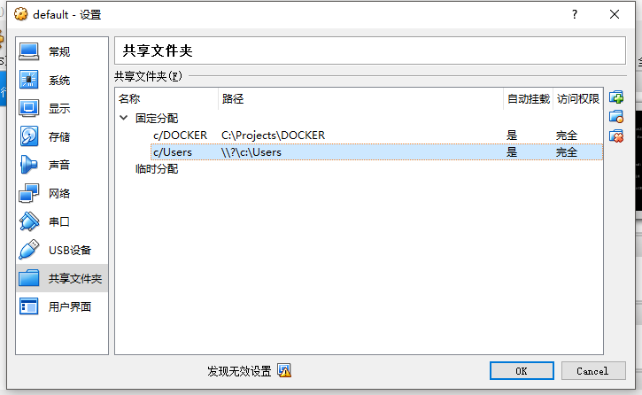

# Docker-toolbox

因目前 `docker for windows` 版本，仅限于 `windows 10` 专业版使用，在家庭版以及`win7`或`win8`并不支持`docker for windows` 版本。所以要想在 `windows 10`版本使用 `docker` 则可以安装 `docker-toolbox`来使用`docker`。其中在新版本的`docker-toolbox`已经默认安装了`docker-compose`。

> docker-toolbox安装包下载地址：
>
> <http://mirrors.aliyun.com/docker-toolbox/windows/docker-toolbox/>
>
> 安装步骤参考地址：
>
> <https://blog.csdn.net/hao_kkkkk/article/details/79853752>

1. **安装Docker-toolbox**

`docker-toolbox`的安装还是比较简单的，下载好安装包后运行安装即可，需要装的依赖软件根据其默认项选择下一步就好。安装完成后，发现在桌面生成了如下三个文件：


因为`docker-toolbox`的原理是在`windows`上装了`Oracle VM VirtualBox`并创建一个`linux`虚拟机，然后在此虚拟机上安装`docker`达到可以在`windows`上使用`docker`的效果，这与你自己在虚拟机上安装`docker`并在虚拟机上操作`docker`的不同之处就是，你可以直接在`windows`的终端上直接使用`docker`的命令。



2. **运行Docker**

双击桌面上的`Docker Quickstart Terminal`打开启动`docker`并进入`Docker`客户端。


可以直接在客户端上输入命令操作docker，也可以关掉该客户端窗口，在打开cmd输入命令都可。

## 关于docker-toolbox 安装的docker 使用挂载目录的问题

这里最主要想说的就是这个，因为在`windows`上通过`docker-toolbox`安装的`docker`是基于`Linux`虚拟机操作，因此在运行`docker`镜像时，想要挂载宿主机(也就是windows系统)上的目录或文件到容器时，需要额外的操作。

1. 打开Oracle VM VirtualBox
   
   可以看到正在运行的虚拟机就是`Docker`所在的`linux`虚拟机。

2. 右键正在运行的虚拟机选择“设置”并选择“共享文件夹”选项卡
   
   在此进行共享文件夹的配置，默认已经共享了用户目录`c:\Users`。当你需要挂载其它的目录或者`windows`上其它的盘符时，首先要在此进行共享文件夹的配置。因为想在docker容器中挂载目录实际是挂载Linux虚拟机上的目录，所以要先把windows宿主机的目录挂载(共享)到Linux虚拟机上。

3. 配置完成后，需要通过命令重启docker机器

   ```
   docker-machine restart
   ```

   经测试在以上操作完成后，如果通过命令进行docker容器的运行并挂载对应的目录是可以成功挂载的
   
   ```
   docker run -it -v /c/DOCKER/config:/config openjdkr sh
   ```
   
   如果`docker-compose.yml`文件的目录挂载配置没有成功，则需要重启电脑。