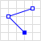

# GeoJSON格式规范说明

[英文原文：The GeoJSON Format Specification](http://geojson.org/geojson-spec.html)

GeoJSON是基于JavaScript对象表示法的地理空间信息数据交换格式。

## 1.简介

GeoJSON是一种用于编码各种地理数据结构的数据。GeoJSON对象可以表示几何、特征或特征集合。GeoJSON支持以下几何类型：点（Point）、线（LineString）、面（Polygon）、多点（MultiPoint）、多线（MultiLineString）、多面（MultiPolygon）和几何集合（GeometryCollection）。GeoJSON中的功能包含几何对象和其他属性，特征集合表示一系列特性。

一个完整的GeoJSON数据结构总是一个（JSON术语里的）对象。在GeoJSON里，对象由一组名称/值对组成 - 也称为成员。对每个成员来说，名称始终是字符串。成员的值要么是字符串、数字、对象、数组，要么是这文本常量的一个："true"，"false"和"null"。数组是由值（上面所说的元素）组成。

### 1.1.举例

GeoJSON特征集合：

```json
{
    "type": "FeatureCollection",
    "features": [
        {
            "type": "Feature",
            "geometry": {
                "type": "Point",
                "coordinates": [102.0, 0.5]
            },
            "properties": {
                "prop0": "value0"
            }
        }, {
            "type": "Feature",
            "geometry": {
                "type": "LineString",
                "coordinates": [
                    [102.0, 0.0],
                    [103.0, 1.0],
                    [104.0, 0.0],
                    [105.0, 1.0]
                ]
            },
            "properties": {
                "prop0": "value0",
                "prop1": 0.0
            }
        }, {
            "type": "Feature",
            "geometry": {
                "type": "Polygon",
                "coordinates": [
                    [100.0, 0.0],
                    [101.0, 0.0],
                    [101.0, 1.0],
                    [100.0, 1.0],
                    [100.0, 0.0]
                ]
            },
            "properties": {
                "prop0": "value0",
                "prop1": {
                    "this": "that"
                }
            }
        }
    ]
}
```

### 1.2.定义

- JavaScript对象（JSON）以及术语对象、名字、值、数组和数字在[IETF RFC 4627](http://www.ietf.org/rfc/rfc4627.txt)里定义。
- 本文档里的关键词“必须”，“不允许”，“需要”，“应当”，“应当不”，“应该”，“不应该”，“推荐”，“可以”和“可选的”在[IETF RFC 2119](http://www.ietf.org/rfc/rfc2119.txt)里解释。

## 2.GeoJSON对象

GeoJSON总是由一个单独的对象组成。此对象（指的是下面的GeoJSON对象）表示几何、特征或者特征集合。

- GeoJSON对象可以包含任意数量的成员（名称/值对）。
- GeoJSON对象必须由一个名字为“type”的成员。此成员的值是一个字符串，用于确定GeoJSON对象的类型。
- type的值必须是如下之一："Point"，"MultiPoint"，"LineString"，"MultiLineString"，"Polygon"，"MultiPolygon"，"GeometryCollection"，"Feature"或者"FeatureCollection"。type值的大小写必须如此处所示。
- GeoJSON对象可以有一个可选“crs”成员，其值必须是坐标参考系统对象。
- GeoJSON对象可以有一个“bbox”成员，其值必须是一个边界框数组。

### 2.1.几何对象

几何是一种GeoJSON对象，这时type属性的值是下面字符串之一："Point"，"MultiPoint"，"LineString"，"MultiLineString"，"Polygn"，"MultiPolygon"，或者"GeometryCollection"。

除了"GeometryCollection"外的其他任何类型的GeoJSON几何对象必须由一个名称为"coordinates(坐标)"的属性。coordinates属性的值总是数组。这个数组里的元素的结构由几何类型来确定。

#### 2.1.1.位置（坐标）

位置是基本的几何结构。"coordinates"几何对象的成员由一个位置（在Point几何体的情况下），位置数组（LineString或MultiPoint几何的请看下），位置数组的数组（Polygons，MultiLineString）或多维位置数组组成（MultiPolygon）。

位置由数字数组表示。必须至少有两个元素，可能更多。元素的顺序必须遵循x，y，z顺序（投影坐标参考系统中坐标的东向、北向、高度，或地理坐标参考系统中坐标的经度，纬度，高度）。允许任意数量的附加元素-附加元素的解释和含义超出了本规范的范围。

#### 2.1.2.点

对于类型"Point"，"coordinates"属性必须是单个坐标。

```json
{
    "type": "Point",
    "coordinates": [100.0, 0.0]
}
```

#### 2.1.3.多点

对于类型"MultiPoint"，"coordinates"属性必须是一个坐标数组。

```json
{
    "type": "MultiPoint",
    "coordinates": [
        [100.0, 0.0],
        [101.0, 1.0]
    ]
}
```

#### 2.1.4.线

对于类型"LineString"，"coordinates"属性必须是两个或两个以上的坐标数组。

线性环是具有4个或者更多坐标的封闭的线。第一个和最后一个位置是相等的（它们表示相同的点）。虽然线性环没有明确表示为GeoJSON几何类型，但它在多边形几何类型定义中有提到它。

```json
{
    "type": "LineString",
    "coordinates": [
        [100.0, 0.0],
        [101.0, 1.0]
    ]
}
```

#### 2.1.5.多线

对类型"MultiLineString"来说，"coordinates"属性必须是LineString坐标数组的数组。

```json
{
    "type": "MultiLineString",
    "coordinates": [
        [ [100.0, 0.0], [101.0, 1.0] ],
        [ [102.0, 2.0], [103.0, 3.0] ]
    ]
}
```

#### 2.1.6 面

对类型"Polygon"来说，"coordinates"属性必须是一个线性环坐标数组的数组。对拥有多个环的面来说，第一个必须是外部环，其它的必须是内部环或孔。

```json
{
    "type": "Polygon",
    "coordinates": [
        [ [100.0, 0.0], [101.0, 0.0], [101.0, 1.0], [100.0, 1.0], [100.0, 0.0] ]
    ]
}
```

```json
{
    "type": "Polygon",
    "coordinates": [
        [ [100.0, 0.0], [101.0, 0.0], [101.0, 1.0], [100.0, 1.0], [100.0, 0.0] ],
        [ [100.2, 0.2], [100.8, 0.2], [100.8, 0.8], [100.2, 0.8], [100.2, 0.2] ]
    ]
}
```

#### 2.1.7.多面

对类型"MultiPlygon"来说，"coordinates"属性必须是面坐标数组的数组。

```json
{ 
    "type": "MultiPolygon",
    "coordinates": [
        [ 
            [ [102.0, 2.0], [103.0, 2.0], [103.0, 3.0], [102.0, 3.0], [102.0, 2.0] ] 
        ], [
            [ [100.0, 0.0], [101.0, 0.0], [101.0, 1.0], [100.0, 1.0], [100.0, 0.0] ],
            [ [100.2, 0.2], [100.8, 0.2], [100.8, 0.8], [100.2, 0.8], [100.2, 0.2] ]
        ]
    ]
}
```

#### 2.1.8.几何集合

类型为"GeometryCollection"的GeoJSON对象是一个集合对象，它表示几何对象的集合。

几何集合必须由一个名称为"geometries"的属性。与"geometries"相对应的值是一个数组。这个数组中的每一个元素都是一个GeoJSON几何对象。

```json
{
    "type": "GeometryCollection",
    "geometries": [
        {
            "type": "Point",
            "coordinates": [100.0, 0.0]
        }, {
            "type": "LineString",
            "coordinates": [
                [101.0, 0.0],
                [102.0, 1.0]
            ]
        }
    ]
}
```

### 2.2.特征对象

类型为"Feature"的GeoJSON对象是特征对象。

- 特征对象必须具有一个名为"geometry"的属性，该属性的值是上面定义的几何对象或JSON null值。
- 特征对象必须具有一个名为"properties"的属性，该属性的值是一个对象（任何JSON对象或者null值）。
- 如果特征是常用的标识符，那么这个标识符应当包含名为"id"的属性。

### 2.3.特征集合对象

类型为"FeatureCollection"的GeoJSON对象是特征集合对象。

类型为"FeatureCollection"的对象必须有一个名字为"features"的属性，该属性的值是一个数组，这个数组中的每个元素都是上面定义的特征对象。

## 3.坐标参考系统对象

GeoJSON对象的坐标参考系统（CRS）是由它的属性"crs"（指的是下面的CRS对象）来确定的。如果对象没有crs属性，那么它的父对象或者祖父对象的crs属性可能被获取作为它的crs。如果这样还没有获得crs属性，那么默认的crs将应用到GeoJSON对象。

- 默认的CRS是一个地理坐标参考系统，使用的是WGS84数据，以十进制的经纬度作为单位。
- "crs"属性的值必须是JSON对象，或者null。如果crs的值为null，那么就相当于没有crs了。
- "crs"属性应该位于GeoJSON对象层次结构中的顶级，并且不应再对象的子项或孙子项上重复或覆盖。
- 非null的"crs"对象必须由两个必须的属性："type"和"properties"。
- "type"属性的值必须是字符串，表示CRS对象的类型。
- "properties"属性的值必须是对象。
- CRS不得更改坐标排序。

### 3.1.CRS

CRS对象可以通过名称来指示坐标参考系统。在这种情况下，它的"type"属性的值必须是字符串"name"。它的"properties"属性的值必须是包含"name"属性的对象。这个"name"属性的值必须是标识坐标参考系统的字符串。OGC CRS URNs such as "urn:ogc:def:crs:OGC:1.3:CRS84" shall be preferred over legacy identifiers such as "EPSG:4326":

```json
"crs": {
    "type": "name",
    "properties": {
        "name": "urn:ogc:def:crs:OGC:1.3:CRS84"
    }
}
```

### 3.2.链接的CRS

CRS对象也可以连接到互联网上的CRS参数。在这种情况下，它的"type"属性的值必须是字符串"link"，它的"properties"属性的值必须是一个链接对象。

#### 3.2.1.链接对象

链接对象由一个必须的属性"href"，和一个可选的属性"type"。

"href"属性的值必须是可解除引用的URI。

"type"属性的值必须是字符串，并且这个字符串暗示了所提供的URI里用来表示CRS参数的格式。建议值是："proj4"，"ogcwkt"，"esriwkt"，也可以使用其他的值。

```json
"crs": {
    "type": "link",
    "properties": {
        "href": "http://example.com/crs/42",
        "type": "proj4"
    }
}
```

相对链接可用于将处理器定向到辅助文件中的CRS参数

```json
"crs": {
    "type": "link",
    "properties": {
        "href": "data.crs",
        "type": "ogcwkt"
    }
}
```

## 4.边框

为了包含几何、特征或者特征集合的坐标范围信息，GeoJSON对象可能有一个名为"bbox"的属性。bbox属性的值必须是`2 * n`数组，这里的`n`是所包含几何对象的维数，其中所有轴的最小值后跟最大值。bbox的轴顺序遵循几何的轴顺序。此外，假设bbox的坐标参考系统与其所属的GeoJSON对象的坐标参考系统匹配。

特征对象上的bbox属性：

```json
{
    "type": "Feature",
    "bbox": [-180.0, -90.0, 180.0, 90.0],
    "geometry": {
        "type": "Polygon",
        "coordinates": [
            [ [-180.0, 10.0], [20.0, 90.0], [180.0, -5.0], [-30.0, -90.0] ]
        ]
    }
    ...
}
```

特征集合对象bbox成员的例子：

```json
{
    "type": "FeatureCollection",
    "bbox": [100.0, 0.0, 105.0, 1.0],
    "features": [
        ...
    ]
}
```

## 5.附录

<table>
    <thead>
        <tr>
            <th>Type</th>
            <th colspan="2">Examples</th>
        </tr>
    </thead>
    <tbody>
        <tr>
            <td>Point</td>
            <td></td>
            <td>
                <pre>
{
    "type": "Point",
    "coordinates": [30, 10]
}</pre>
            </td>
        </tr>
        <tr>
            <td>MultiPoint</td>
            <td></td>
            <td>
                <pre>
{
    "type": "MultiPoint", 
    "coordinates": [
        [10, 40], [40, 30], [20, 20], [30, 10]
    ]
}</pre>
            </td>
        </tr>
        <tr>
            <td>LineString</td>
            <td></td>
            <td>
                <pre>
{
    "type": "LineString",
    "coordinates": [
        [30, 10], [10, 30], [40, 40]
    ]
}</pre>
            </td>
        </tr>
        <tr>
            <td>MultiLineString</td>
            <td></td>
            <td>
                <pre>
{
    "type": "MultiLineString", 
    "coordinates": [
        [[10, 10], [20, 20], [10, 40]], 
        [[40, 40], [30, 30], [40, 20], [30, 10]]
    ]
}</pre>
            </td>
        </tr>
        <tr>
            <td rowspan="2">Polygon</td>
            <td></td>
            <td>
                <pre>
{
	"type": "Polygon", 
	"coordinates": [
		[[30, 10], [40, 40], [20, 40], [10, 20], [30, 10]]
	]
}</pre>
            </td>
        </tr>
        <tr>
            <td></td>
            <td>
                <pre>
{
    "type": "Polygon", 
    "coordinates": [
        [[35, 10], [45, 45], [15, 40], [10, 20], [35, 10]], 
        [[20, 30], [35, 35], [30, 20], [20, 30]]
    ]
}</pre>
            </td>
        </tr>
        <tr>
            <td rowspan="2">MultiPolygon</td>
            <td></td>
            <td>
                <pre>
{
    "type": "MultiPolygon", 
    "coordinates": [
        [
            [[30, 20], [45, 40], [10, 40], [30, 20]]
        ], 
        [
            [[15, 5], [40, 10], [10, 20], [5, 10], [15, 5]]
        ]
    ]
}</pre>
            </td>
        </tr>
        <tr>
            <td></td>
            <td>
                <pre>
{
    "type": "MultiPolygon", 
    "coordinates": [
        [
            [[40, 40], [20, 45], [45, 30], [40, 40]]
        ], 
        [
            [[20, 35], [10, 30], [10, 10], [30, 5], [45, 20], [20, 35]], 
            [[30, 20], [20, 15], [20, 25], [30, 20]]
        ]
    ]
}</pre>
            </td>
        </tr>
    </tbody>
</table>


