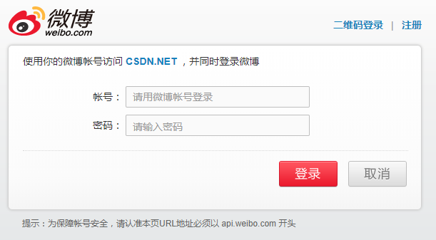
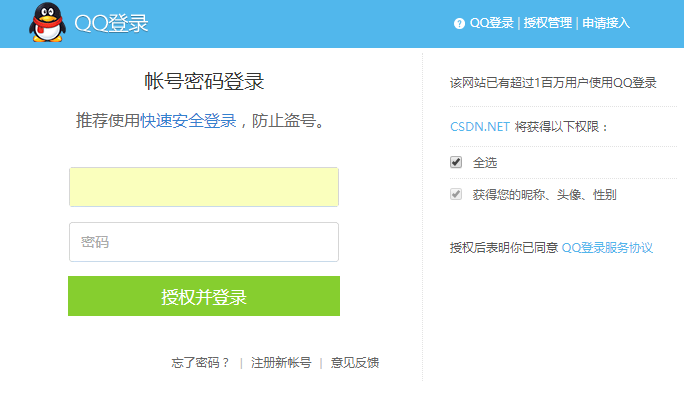
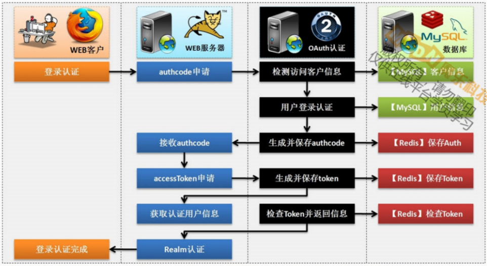
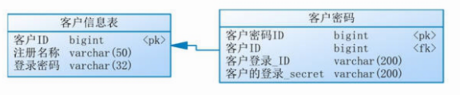

# OAuth

## OAuth认证简介

在一个完整的项目之中你有可能会经常性的去完成每一个系统之中用户登录操作（认证），但是如果是一个内部的企业系统，可能会有无数个子系统出现，那么肯定不可能将所有的子系统都重新实现一次登录认证，这样的代价实在是太庞大了，那么为了解决这样的问题，往往会采用单点登录的模式来完成，也就是说所有的授权子系统都可以采用同一个登录认证模式来完成。对于单点登录的技术有很多种实现手段，而现在最流行的实现手段就是OAuth认证协议。

**新浪微博登录：**



```
https://api.weibo.com/oauth2/authorize?client_id=2601122390&response_type=code&redirect_uri=https://认证之后的返回地址
```

**腾讯QQ登录：**



```
https://graph.qq.com/oauth2.0/show?which=Login&display=pc&response_type=code&client_id=100270989&redirect_uri=https://登录后的返回地址
```

而现在看见的这一系列操作都属于OAuth协议的实现。所以随着当前互联网的发展势头，掌握OAuth的登录认证的处理才是现在最标准的做法。

**OAuth(Open Authorization)**

- OAuth协议为用户资源的授权提供了一个安全的、开放而又简易的标准。
- OAuth的授权不会使第三方接触到用户的账号信息（如用户名与密码），即第三方无需使用用户的用户名与密码就可以申请获得该用户资源的授权，因此OAuth是安全的。

**OAuth协议特点**

- 简单：不管是OAuth服务提供者还是应用开发者，都很易于理解与使用；
- 安全：没有涉及到用户秘钥等信息，更安全更灵活；
- 开放：任何服务提供商都可以实现OAuth，任何软件开发商都可以使用OAuth；



在整个的OAuth处理之中核心的关键是需要获得一个accessToken的信息标签，这个标签直接决定了你是否已经成功登录过的关键操作。但是如果要想获得此Token信息，那么必须获得一个authcode信息。

如果把整个的OAuth认证比喻为动物园的门票的话，那么这个门票会有两张卷：

- 第一张副券：能否进入动物园大门的票（authcode）；
- 第二张副券：能否进入海洋馆的门票（accessToken）；

## 搭建OAuth认证服务端

OAuth之中的核心处理流程就在于需要提供有一个完整的客户端的认证资源操作，而这个资源操作就是client_id的细腻，但是只是依靠一个client_id是不能够进行所谓的成功登录的，还需要有一个clientSecret；在实际的开发之中，由于用户有可能会丢失client_id的信息，所以理论上应该设计有注册的客户表以及对应的client_id的信息。



### 定义客户认证微服务

既然现在需要做一个注册客户的访问认证处理操作，那么自然就需要做一个新的微服务操作。

1. 创建一个新的微服务项目