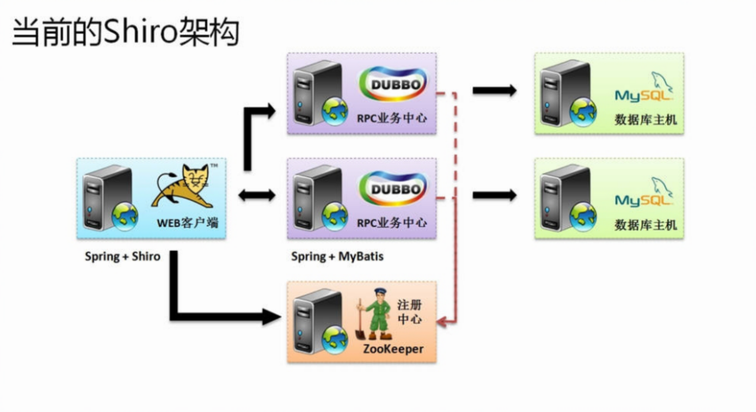
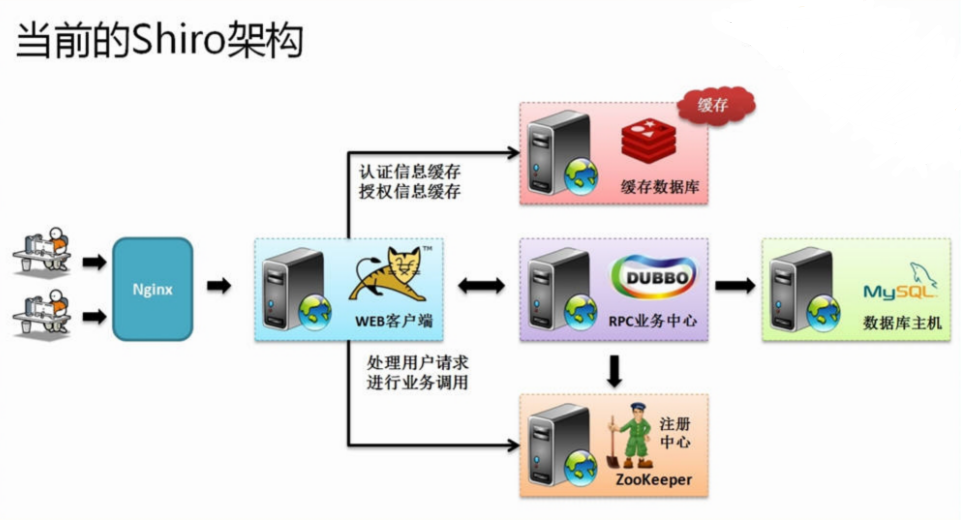
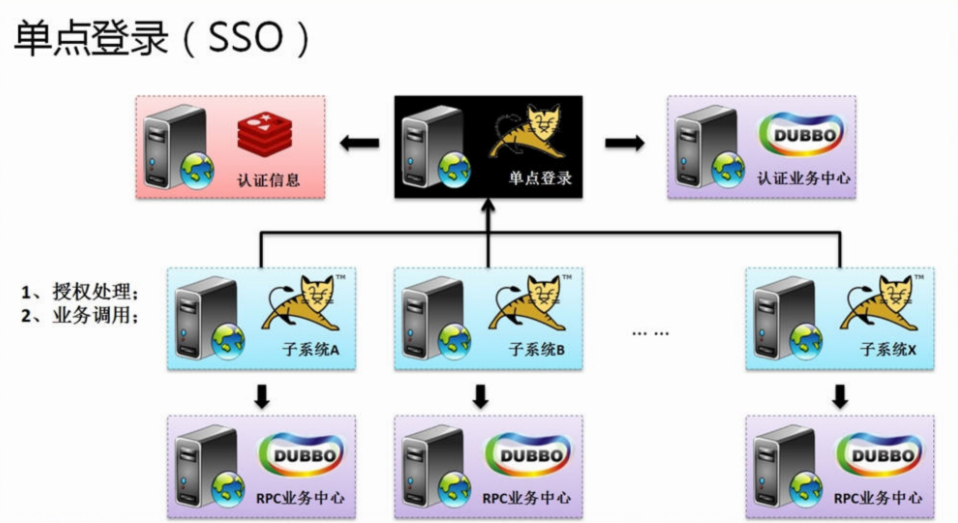

## 企业级架构会话管理概述

在一套完整的企业级开发架构设计过程之中你会发现以下几个部分是其核心的组成：

- 一套完整的RPC业务中心，利用业务中心可以有效的实现业务分割，同时利用微架构的概念也可以更好的去进行业务的设计（微架构本身是存在有缺陷，多个业务之间有可能会出现互相调用的依赖问题，允许忽略）；
- 在整个企业的项目开发之中认证与授权是一个非常重要的话题，如果没有严格的认证与授权的控制机制，会感觉到你的系统像在裸奔一样（WEB端）；
- 数据的换乘设计非常重要，对于缓存可以使用单主机的缓存控制，也可以采用缓存数据库进行分布式的缓存处理；
- 在一个企业之中应该提供有一个统一的用户认证服务，即：所有的服务都可以依赖于此认证机制实现处理；

所以现在对于任何一个企业级的架构设计来讲，都需要去努力解决以上的问题，之所以现在的开发框架之中Shiro非常的流行是因为它可以帮助所有的开发者快速的构建一个符合于现企业级的认证管理处理方案，其中也包括了它自己的缓存方案和单点登录解决方案。

以一个当前的企业设计开发框架为例说明其发展的过程，如果按照一个最为传统的项目设计，那么此时在整个项目之中应该包含有如下的几个组成部分：

- RPC业务端（Dubbo）：实现业务层的定义以及数据层的操作；
  - 经典方案：Spring + Hibernate、处理速度很慢；
  - 后续方案：Spring + MyBatis、Spring + JPA；
- RPC消费端（WEB）：实现业务调用以及认证和授权的检测处理操作；
  - 第一代方案：Spring + SpringSecurity；
  - 第二代方案：Spring + Shiro。

当前的架构之中并没有过多的去考虑WEB端的优化（缓存配置以及单点登录设计）。

在整个Shiro之中realm为了避免重复执行，往往采用的形式是：将认证与授权数据直接通过EHCache进行缓存。但是在这之中实际上还存在有两个情况：用户的密码会存在有尝试失败的次数限制，重复登录问题。如果一个项目之中可能有若干个子系统出现，那么这些子系统不可能都做各自的登录处理，应该有一个统一的登录控制端提供认证服务（只提供认证服务，授权是不同的）。

所以在一个标准的企业架构设计过程之中，会有无数个子系统，那么对于这些子系统都需要有一个完整的登录认证解决方案，所以需要使用Redis来做单点登录处理，同时还需要考虑到用户数据的缓存问题，那么就涉及到了分布式缓存处理操作。