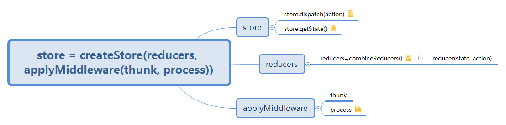

[TOC]

# React

create-react-app 是React官方提供的一个用于快速搭建项目的脚手架

```
npm install -g create-react-app
create-react-app myapp
cd myapp
npm start
```

使用create-react-app创建的React项目时，有时在安装其他组件后，再次运行npm start命令时会报错误`'react-scripts' 不是内部或外部命令，也不是可运行的程序或批处理文件。`原因是create-react-app有丢包的缺陷，手动安装包后，需要重新`npm install`一下，这样node_modelus/.bin/目录下才会重新出现react-scripts的文件，这样npm start命令才能征程执行。

```
npm install react-scripts
// or 
npm install
```

但是打开项目会发现，一些与webpack相关的东西被隐藏掉了，只需要键入命令

```
npm run eject
```

对界面的编辑会实时刷新。可以在控制台下看到构建错误和语法警告

```
npm run build
```

The build folder is ready to be deployed.

You may serve it with a static server:

```
yarn global add serve
serve -s build
```

## React生命周期


> 如图，React生命周期主要包括三个阶段：初始化阶段、运行中阶段和销毁阶段，在react不同的生命周期里，会依次触发不同的钩子函数。

### 一、初始化阶段

1、设置组件的默认属性

```js
static defaultProps = {
    name: 'abc',
    age: 23
};
// or
Counter.defaltProps = {name: 'abc'};
```

2、设置组件的初始化状态

```javascript
constructor() {
    super();
    this.state = {number: 0};
}
```

3、componentWillMount()

> 组件即将被渲染到页面之前触发，此时可以进行开启定时器、想服务器发送请求等操作。

4、render()

> 组件渲染。

5、componentDidMount()

> 组件已经被渲染到页面中后触发：此时页面中有了真正的DOM的元素，可以进行DOM相关的操作。

### 二、运行中阶段

1、componentWillReceiveProps()

> 组件接收到属性时触发。

2、sholdComponentUpdate()

> 当组件接收到新属性，或者组件的状态发生改变时触发。组件首次渲染时并不会触发。
>
> ```js
> sholdComponentUpdate(newProps, newState) {
>     if (newProps.number < 5) return true;
>     return false;
> }
> // 该钩子函数可以接收到两个参数，新的属性和状态，返回true/false来控制组件是否需要更新。
> ```
>
> 一般我们通过该函数来优化性能：
>
> 一个React项目需要更新一个小组件时，很可能需要父组件更新自己的状态。而一个父组件的重新更新会造成它旗下所有的子组件重新执行render()方法，形成新的虚拟DOM，再用diff算法对新旧虚拟DOM进行结构和属性的比较，决定组件是否需要重新渲染
>
> 无疑这样的操作会造成很多的性能浪费，所以我们开发者可以根据项目的业务逻辑，在`shuldComponentUpdate()`中加入条件判断，从而优化性能
>
> 例如React中的就提供了一个PureComponent的类，当我们的组件继承于它时，组件更新时就会默认先比较新旧属性和状态，从而决定组件是否更新。值得注意的是，PureComponent进行的是浅比较，所以组件状态或属性改变时，都需要返回一个新的对象或数组

3、componentWillUpdate()

> 组件即将被更新时触发。

4、componentDidUpdate()

> 组件被更新完成后触发。页面中产生了新的DOM的元素，可以进行DOM操作

### 三、销毁阶段

1、componentWillUnmount()

> 组件被销毁时触发。这里我们可以进行一些清理操作，例如清理定时器，取消Redux的订阅事件等等。

### 四、总结

组件的生命周期可分成三个状态：

- Mounting：已插入真实DOM
- Updating：正在被重新渲染
- Unmounting：已移出真实DOM

生命周期的方法有：

- componentWillMount：在渲染前调用，在客户端也在服务端。
- componentDidMount：在第一次渲染后调用，只在客户端。之后组件已经生成了对应的DOM结构，可以通过this.getDOMNode()来进行访问。如果你想和其他JavaScript框架一起使用，可以在这个方法中调用setTimeout，setInterval或者发送AJAX请求等操作（防止异步操作阻塞UI）。
- componentWillReceiveProps：在组件接收到一个新的prop（更新后）时被调用。这个方法在初始化render时不会被调用。
- shouldComponentUpdate：返回一个布尔值。在组件接收到新的props或者state时被调用。在初始化时或者使用forceUpdate时不被调用。可以在你确认不需要更新组件时使用。
- componentWillUpdate：在组件接收到新的props或者state但还没有render时被调用。在初始化时不会被调用。
- componentDidUpdate：在组件完成更新后立即调用。在初始化时不会被调用。
- componentWillUnmount：在组件从DOM中移除的时候立刻被调用。

```jsx
import React, {Component} from 'react';

class SubCounter extends React.Component {
    componentWillReceiveProps() {
        console.log('9、子组件将要接收到新属性');
    }

    shouldComponentUpdate(newProps, newState) {
        console.log('10、子组件是否需要更新');
        if (newProps.number < 5) return true;
        return false
    }

    componentWillUpdate() {
        console.log('11、子组件将要更新');
    }

    componentDidUpdate() {
        console.log('13、子组件更新完成');
    }

    componentWillUnmount() {
        console.log('14、子组件将卸载');
    }

    render() {
        console.log('12、子组件挂载中');
        return (
                <p>{this.props.number}</p>
        )
    }
}

class Counter extends React.Component {
    static defaultProps = {
        //1、加载默认属性
        name: 'sls',
        age:23
    };

    constructor() {
        super();
        //2、加载默认状态
        this.state = {number: 0}
    }

    componentWillMount() {
        console.log('3、父组件挂载之前');
    }

    componentDidMount() {
        console.log('5、父组件挂载完成');
    }

    shouldComponentUpdate(newProps, newState) {
        console.log('6、父组件是否需要更新');
        if (newState.number<15) return true;
        return false
    }

    componentWillUpdate() {
        console.log('7、父组件将要更新');
    }

    componentDidUpdate() {
        console.log('8、父组件更新完成');
    }

    handleClick = () => {
        this.setState({
            number: this.state.number + 1
        })
    };

    render() {
        console.log('4、render(父组件挂载)');
        return (
            <div>
                <p>{this.state.number}</p>
                <button onClick={this.handleClick}>+</button>
                {this.state.number<10?<SubCounter number={this.state.number}/>:null}
            </div>
        )
    }
}
ReactDOM.render(<Counter/>, document.getElementById('root'));
```

****

# Redux

> [Redux中文文档](http://www.redux.org.cn)
>
> [Redux官方文档](https://redux.js.org)

Redux是JavaScript状态容器，提供可预测化的状态管理。可以让你构建一致化的应用，运行于不同的环境（客户端、服务器、原生应用），并且易于测试。

Redux除了和React一起用外，还支持其它界面库。



## 要点

在react-redux应用中所有的state都以一个对象树的形式存储在一个单一的store中。唯一改变state的办法是触发action，一个描述发生什么的对象。为了描述action如何改变state树，就需要编写reducers。

```javascript
import { createStore } from 'redux';

/**
 * 这是一个reducer，形式为(state, action) => state 的纯函数。
 * 描述了 action 如何把 state 转变成下一个state
 *
 * state的形式取决于你，可以使基本类型、数组、对象、
 * 甚至是 Immutabl.js 生成的数据结构。唯一的要点是
 * 当 state 变化时需要返回全新的对象，而不是修改传入的参数。
 *
 * 下面的例子使用 `switch` 语句和字符串来判断，但你可以写帮助类（helper）
 * 根据不同的约定（如方法映射）来判断，只要适用你的项目即可。
 */
let counter = (state = 0, action) => {
    switch(action.type) {
        case 'INCREMENT':
            return state + 1;
        case 'DECREMENT':
            return state - 1;
        default:
            return state;
    }
}

// 创建 Redux store 来存放应用的状态。
// store 的 API 是 { subscribe, dispatch, getState }
let store = createStore(counter);

// 可以手动订阅更新，也可以事件绑定到视图层。
store.subscribe(() => console.log(store.getState));

// 改变内部 state 唯一方法是 dispatch 一个 action。
// action 可以被序列化，用日志记录和存储下来，后期还可以以回放的方式执行
store.dispatch({ type: 'INCREMENT'}); // state = 1
store.dispatch({ type: 'INCREMENT'}); // state = 2
store.dispatch({ type: 'DECREMENT'}); // state = 1
```

在实际开发中应该把要做的修改变成一个普通对象，这个对象被叫做action，而不是直接修改state。然后编写专门的函数来决定每个action如何改变用的state，这个函数被叫做reducer。

## 入门示例

1、创建react应用

```
create-react-app react-redux-demo
```

2、安装redux

```
npm install --save redux

# 附加包
npm install --save react-redux
npm install --save-dev redux-devtools
```

> react-redux：Redux的官方React绑定库
>
> redux-devtools：开发工具，可以实时的监控Redux的状态树的store

3、创建官方示例组件`Counter`（src/components/Counter.js）

```javascript
import React, { Component } from 'react';

class Counter extends Component {

    constructor() {
        super();
        this.incrementIfOdd = this.incrementIfOdd.bind(this);
        this.incrementAsync = this.incrementAsync.bind(this);
    }

    incrementIfOdd() {
        if (this.props.value % 2 !== 0) {
            this.props.onIncrement();
        }
    }
    
    incrementAsync() {
        setTimeout(this.props.onIncrement, 1000);
    }
    
    render() {
        const { value, onIncrement, onDecrement } = this.props;
        return (
            <div>
                Clicked: {value} times
                {' '}
                <button onClick={onIncrement}> + </button>
                {' '}
                <button onClick={onDecrement}> - </button>
                {' '}
                <button onClick={this.incrementIfOdd}> Increment if odd </button>
                <button onClick={this.incrementAsync}> Increment async </button>
            </div>
        );
    }
    
}

export default Counter;
```

4、创建reducers （src/reducers/index.js）

```javascript
/**
 * 这是一个reducer，形式为(state, action) => state 的纯函数。
 * 描述了 action 如何把 state 转变成下一个state
 *
 * state的形式取决于你，可以使基本类型、数组、对象、
 * 甚至是 Immutabl.js 生成的数据结构。唯一的要点是
 * 当 state 变化时需要返回全新的对象，而不是修改传入的参数。
 *
 * 下面的例子使用 `switch` 语句和字符串来判断，但你可以写帮助类（helper）
 * 根据不同的约定（如方法映射）来判断，只要适用你的项目即可。
 */
export default (state = 0, action) => {
    switch (action.type) {
        case 'INCREMENT': return state + 1;
        case 'DECREMENT': return state - 1;
        default: return state;
    }
}
```

5、修改index.js （src/index.js）

```javascript
import React from 'react';
import ReactDOM from 'react-dom';
import { createStore } from 'redux';
import Counter from './components/Counter';
import counter from './reducers';
import registerServiceWorker from './registerServiceWorker';

// 创建 Redux store 来存放应用的状态。
// store 的 API 是 { subscribe, dispatch, getState }
const store = createStore(counter);

const render = () => ReactDOM.render(
    <Counter
        value={store.getState()}
        // 改变内部 state 唯一方法是 dispatch 一个 action。
        onIncrement={() => store.dispatch({ type: 'INCREMENT' })}
        onDecrement={() => store.dispatch({ type: 'DECREMENT' })}
    />,
    document.getElementById('root')
);

render();
// 订阅更新，绑定到视图层。
store.subscribe(render);

registerServiceWorker();
```

## Action

**Action** 是把数据从应用传到 store 的有效载荷。它是 store 数据的**唯一**来源。一般来说你会通过`store.dispatch()`将 action 传到 store。

```json
{
    type: 'ADD_TODO',
    text: 'Build my first Redux app'
}
```

Action 本质上是JavaScript普通对象。我们约定，action内必须使用一个字符串类型的`type`字段来表示将要执行的动作。多数情况下，`type`会被定义成字符串常量。当应用规模越来越大时，建议使用单独的模块或文件来存放action。

除了`type`字段外，action对象的结构完全由你自己决定。**不过，我们应该尽量减少在action中传递的数据**

**Action创建函数** 就是生成action的方法。“action”和“action创建函数”这两个概念很容易混在一起，使用时最好注意区分。

在Redux中的action创建函数只是简单的返回一个action：

```javascript
let addTodo = text => ({type: 'ADD_TODO', text});
```

这样做将使action创建函数更容易被移植和测试。

`actions.js`

```javascript
/*
 * action 类型
 */

export const ADD_TODO = 'ADD-TODO';
export const TOGGLE_TODO = 'TOGGLE_TODO';
export const SET_VISIBILITY_FILTER = 'SET_VISIBILITY_FILTER';

/*
 * 其它的常量
 */

export const VisibilityFilters = {
    SHOW_ALL: 'SHOW_ALL',
    SHOW_COMPLETED: 'SHOW_COMPLETED',
    SHOW_ACTIVE: 'SHOW_ACTIVE'
}

/*
 * action 创建函数
 */

export const addTodo = text => ({ type: ADD_TODO, text });
export const toggleTodo = index => ({ type: TOGGLE_TODO, index });
export const setVisibilityFilter = filter => ({ type: SET_VISIBILITY_FILTER, filter });
```

## Reducer

**Reducers**指定了应用状态的变化如何响应 actions 并发送到 store 的，记住 actions 只是描述了有事情发生了这一事实，并没有描述应用如何更新 state。

在Redux应用中，所有的state都被保存在一个单一对象中。建议在写代码前先想一下这个对象的结构。如何才能以最简的形式把应用的state用对象描述出来。

reducer就是一个纯函数，接收旧的state和action，返回新的state。

```
(previousState, action) => newState
```

之所以将这样的函数称之为reducer，是因为这种函数与被传入`Array.prototype.reduce(reducer, ?initialValue)`里的回调函数术语相同的类型。保持reducer纯净非常重要。永远不要在reducer里做这些操作:

- 修改传入参数；
- 执行有副作用的操作，如API请求和路由跳转；
- 调用非纯函数，如`Date.now()`或`Math.random()`。

### combineReducers

随着应用的膨胀，我们需要将reducer拆分放到不同的文件中，以保持其独立性并用于专门处理不同的数据域。因此，Redux提供了`combineReducers()`工具类来把拆分的reducer整合起来。

```jsx
import { combineReducers } from 'redux';

const todoApp = combineReducers({
    visibilityFilter,
    todos,
});
```

```jsx
const reducer = combineReducers({
    a: doSomethingWithA,
    b: processB,
    c: c
});
```

`combineReducers()` 所做的只是生成一个函数，这个函数来调用你的一系列reducer，每个reducer根据它们的key来筛选出state中的一部分数据并处理，然后这个生成的函数再将素有reducer的结果合并成一个大的对象。没有任何魔法。正如其他reducers，如果combineReducers()中包含的所有reducers都没有更改state，那么也就不会创建一个新的对象。

> ### ES6注意
>
> `combineReducers`接收一个对象，可以把所有顶级的reducer放到一个独立的文件中，通过export暴露出每个reducer函数，然后使用`import * as reducers`得到一个以它们名字作为key的object：
>
> ```jsx
> import { combineReducers } from 'redux';
> import * as reducers from './reducers';
> 
> const todoApp = combineReducers(reducers);
> ```

## Store

在上文已经简要的介绍了使用action来描述“发生了什么”，和使用reducers来根据action更新state的用法。

**Store**就是把它们联系到一起的对象。Store有以下职责：

- 维持应用的state；
- 提供`getState()`方法获取state；
- 提供`dispatch(action)`方法更新state；
- 通过`subscribe(listener)`注册监听器；
- 通过`subscribe(listener)`返回的函数注销监听器。

再次强调以下**Redux应用只有一个单一的store**。当需要拆分数据处理逻辑时，应该使用reducer组合而不是创建多个store。

根据已有的reducer来创建store是非常容易的。如使用`combineReducers()`将多个reducer合并成为一个。

```jsx
import { createStore } from 'redux';
import todoApp from './reduers';
let store = createStore(todoApp);
```

`createStore()`的第二个参数是可选的，用于设置state初始状态。这对开发同构应用时非常有用，服务器端redux应用的state结构可以与客户端保持一致，那么客户端可以将从网络接收到的服务端state直接用于本地数据初始化。

```js
let store = createStore(todoApp, window.STATE_FROM_SERVER);
```

```js
// 打印初始状态
console.log(store.getState())

// 每次 state 更新时，打印日志
// 注意 subscribe() 返回一个函数用来注销监听器
const unsubscribe = store.subscribe(() =>
  console.log(store.getState())
)

// 发起一系列 action
store.dispatch(addTodo('Learn about actions'))
store.dispatch(addTodo('Learn about reducers'))
store.dispatch(addTodo('Learn about store'))

// 停止监听 state 更新
unsubscribe();
```

### applyMiddleware

redux中间件

```js
import Reducer from './Reducer';
import {createStore, applyMiddleware} from 'redux';

let store = createStore(Reducer, applyMiddleware());
export {store};
function xxx({getState}) {
    return function (dispatch) {
        return function (action) {
            // 在执行state操作之前的中间操作都可以在此完成
            //dispatch(action);
        }
    }
}
```

### redux-thunk

thunk也是一个中间件，可使dispatch异步执行。

```js
npm install --save redux-thunk
```

```js
import thunk from 'redux-thunk';
let store = createStore(Reducer, applyMiddleware(thunk, leo));
```

```js
// 原来同步的方式
store.dispatch({type: 'add', text: 'xxx'});

// 使用thunk后，异步的方式
store.dispatch(function(dispatch){
    dispatch({type: 'add', text: 'xxx'});
});
```


## compose

`compose(...functions)`

从右到左来组合多个函数。

这时函数式编程中的方法，为了方便，被放到了Redux里。

当需要把多个store增强器依次执行的时候，需要用到它。

**1、参数**

(arguments): 需要合成的多个函数。预计每个函数都接收一个参数。它的返回值将作为一个参数提供给它左边的函数，以此类推。例外是最右边的参数可以接受多个参数，因为它将为由此参数的函数提供签名。(`compose(funcA, funcB, funcC)`形象为`compose(funcA(funcB(funcC())))`)

**2、返回值**

(Function)：从右到左把接受到的函数合成后的最终函数。

**3、示例**

下面示例颜色了如何使用`compose`增强store，这个store与`applyMiddleware`和redux-devtools一起使用。

```jsx
import { createStore, applyMiddleware, compose } from 'redux';
import thunk from 'redux-thunk';
import DevTools from './containers/DevTools';
import reducer from '../reducers';

const store = createStore(
	reducer,
    compose(
    	applyMiddleware(thunk),
        DevTools.instrument()
    )
);
```

**4、小贴士**

`compose`做得只是让你在写深度嵌套的函数时，避免了代码的向右偏移。

## `<Provider store>`

`<Provider store>`使组件层级中的`connect()`方法都能够获得Redux store。正常情况下，你的根组件应该嵌套在`<Provider>`中才能使用`connect()`方法。

如果你真的不想把根组件嵌套在`<Provider>`中，你可以把`store`作为props传递到每一个被`connect()`包装的组件。不过正常情况下还是推荐使用`<Provider>`。

**属性**

- `store`(Redux Store)：应用程序中唯一的Redux store对象
- `children`(ReactElement)：组件层级的根组件。

**例子**

```jsx
// Vanilla React
ReactDOM.render(
	<Provider store={store}>
    	<MyRootComponent/>
    </Provider>,
    rootEl
);
```

```jsx
// React Router
ReactDOM.render(
	<Provider store={store}>
    	<Router history={history}>
        	<Route path="/" component={App}>
            	<Route path="foo" component={Foo}/>
            	<Route path="bar" component={Bar}/>
            </Route>
        </Router>
    </Provider>,
    document.getElementById('root')
);
```

## `connect([mapStateToProps], [mapDispatchToProps], [mergeProps], [options])`

连接React组件与Redux store

连接操作不会改变原来的组件类。
反而返回一个新的已与Redux store连接的组件类。

**参数**

- `[mapStateToProps(state, [ownProps]): stateProps]`(Function): 如果定义该参数，组件将会监听Redux store的变化。任何时候，只要Redux store发生改变，`mapStateToProps`函数就会被调用。该回调函数必须返回一个纯对象，这个对象会与组件的props合并。如果你省略了这个参数，你的组件将不会监听Redux store。如果指定了该回调函数中的第二个参数`ownProps`，则该参数的值为传递到组件的props，而且只要组件接收到新的props，`mapStateToProps`也会被调用（例如，当props接收到来自父组件一个小小的改动，那么你所使用的ownProps参数，mapStateToProps都会被重新计算）。
- `[mapDispatchToProps(dispatch, [ownProps]): dispatchProps](Object OR Function)`:如果传递的是一个对象，那么每个定义在该对象的函数都被当做Redux action creator，对象所定义的方法名将作为属性名；每个方法将返回一个新的函数，函数中`dispatch`方法会将action creator的返回值作为参数执行。这些属性会被合并到组件的props中。

如果传递的是一个函数，该函数将接受一个dispatch函数，然后由你来决定如何返回一个对象，这个对象通过dispatch函数与action creator以某种方式绑定在一起（提升：你也许会用到Redux的辅助函数`bindActionCreators()`。如果你省略这个`mapDispatchToProps`参数，默认情况下，dispatch会注入到你的组件props中。如果指定了该毁掉函数中第二个参数ownProps，该参数的值为传递到组件的props，而且只要组件接收到新props，mapDispatchToProps也会被调用。

- `[mergeProps(stateProps, dispatchProps, ownProps): props](Function)`: 如果指定了这个参数，mapStateToProps()与mapDispatchToProps()的执行结果和组件自身的props将传入到这个回调函数中。该毁掉函数返回的对象将作为props传递到被包装的组件中。你也许可以用这个毁掉函数，根据组件的props来筛选部分的state数据，或者把props中的某个特定变量与action creator绑定在一起。如果你省略这个参数，默认情况下返回`object.assign({}, ownProps, stateProps, dispatchProps)`的结果。
- `[options]`(Object)如果指定这个参数，可以定制connector的行为。
  - `[pure = true]`(Boolean): 如果为true，connector将执行`shouldComponentUpdate`并且浅对比mergeProps的结果，避免不必要的更细，前提是当前组件时一个“纯”组件，它不依赖于任何的输入或state而只依赖于props和Redux store的state。默认值为true。
  - `[withRef =false]`(Boolean):如果为true，connector会保存一个对被包含的组件实例的引用，该引用通过getWrappedInstance()方法获得。默认值为false。

# redux-actions

> [redux-actions.js.org](https://redux-actions.js.org/)
>
> [使用Redux打造你的应用——redux-actions](https://github.com/ecmadao/Coding-Guide/blob/master/Notes/React/Redux/%E4%BD%BF%E7%94%A8%20Redux%20%E6%89%93%E9%80%A0%E4%BD%A0%E7%9A%84%E5%BA%94%E7%94%A8%20%E2%80%94%E2%80%94%20redux-actions.md)

redux-actions，一个帮助redux应用快速创建actons、reducers的辅助类函数库。通过他，可以摈弃掉传统的redux action/reducer定义方法，更加快速有效的创建一个redux应用。

在这之前，我们可以先看看在传统redux中是如何定义action和reducer的：

```js
// actions.js
export const INITIAL = 'INITIAL';
export const initial = (initialValue) => {
    return {
        type: INITIAL,
        state: initialValue
    }
}
```

```js
// reducers.js
import { combineReducers } from 'redux';
import * as ACTIONS from './actions.js';

const state = {
    initialValue: 0
};

const initialValue = (initialValue = state.initialValue, action) {
    switch(action.type) {
        case ACTIONS.INITIAL:
            return action.state;
        default:
            return initialValue;
    }
} ;

export default combineReducers(initialValue);
```

而在使用了redux-actions之后，整个过程可以得到极大的简化：

```js
// actions.js
const initial = createAction('INITIAL');
export default {initial};
```

```js
const state = {initialValue: 0};

const reducer = handleActions(
    INITIAL(state, action) {
    	return (
			...state,
    		initialValue: action.playload
		);
    },
    state
);

export default reducer;
```

## createAction

通过`createAction`API，可以快速的创建方法。

```js
const initial = createAction('INITIAL');
// initial 方法等同于
const initial = (value) => {
    return {
        type: 'INITIAL',
        payload: value
    }
};

// 也可以手动代入方法
const initial = createAction('INITIAL', () => null);
// 相当于
const initial = () => {
  return {
    type: INITIAL,
    payload: null
  }
};

const initial = createAction('INITIAL', (name, email) => ({name, email}));
// 相当于
const initial = (name, email) => {
  return {
    type: INITIAL,
    payload: {
      name,
      email
    }
  }
};
```

同时也提供了`createActions`API，用来批量创建方法：

```js
const {
    initial,
    setName,
    setEmail
} = createActions(
	'INITIAL',
    'SET_NAME',
    'SET_EMAIL'
);

// 如果要给某个方法指定自己的函数，比如
// const inital = createAction('INITIAL', () => null)
const {
    initial,
    setName,
    setEmail
} = createActions({
    'INITIAL': ()=>null
	}, 
    'SET_NAME', 
    'SET_EMAIL'
);
```

## handleActions

通过`handleActions`一次性处理所有的action handler，不再需要传统的`combineReducers`

```js
import { handleActions } from 'redux-actions';

const reducer = handleActions({
    INCREMENT: (state, action) => ({
        counter: state.counter + action.payload
    }),
    DECREMENT: (state, action) => ({
        counter: state.counter - action.payload
    })
}, { counter: 0});

export default reducer;
```

通过官方的实例可以看出，其实本质就是将产生依次带入每个reducer进行调用，返回最终的结果。因此，核心和redux的`combineReducer`是一样的：将action依次代入每个reducer进行调用，总有一个reducer可以处理当前的action.type，否则返回default。

