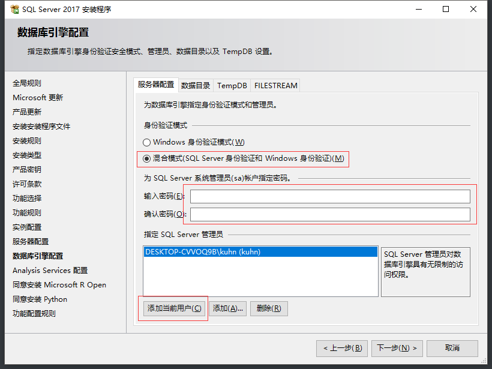
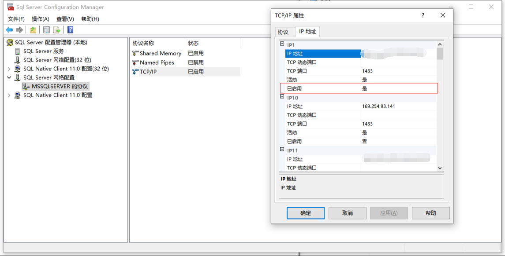

# SQL Server 安装

## SQL Server

## SQL Server Management Studio

## SQL Server 启用1433端口

打开SQL Server配置管理中心，先停掉SQL Server服务！

SQL Server网络配置，选择数据库实例的协议，TCP/IP 属性

TCP/IP属性里的IP地址，设置“已启用”为是。以及IPALL的TCP端口为1433

SQL 的客户端协议也同时启用1433端口

设置完成后，重新启用SQL Server服务

## 防火墙打开1433端口

打开高级设置。

入站/出站，都分别新建TCP/UDP规则

