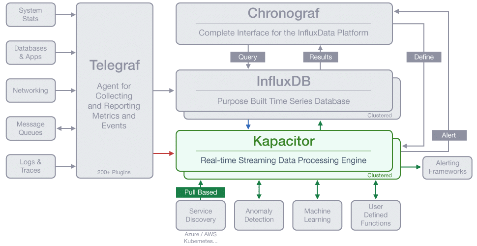

# Kapacitor

数据处理、报警、异常探测

Kapacitor是TICK堆栈中的一个本地数据处理引擎。它建立在一个开源核心之上，通过我们的Telegraf插件为各种数据库、服务和应用程序提供集成，以满足你的需求。通过Chronograf接口，用户可以创建自定义逻辑或函数，为基于时间的操作创建查询。用户可以使用动态阈值处理警报，匹配模式的指标，计算统计异常，并基于这些警报执行待定的操作，比如动态负载再平衡。



## 安装

```shell
# OS X
brew update
brew install kapacitor

# Docker Image
docker pull kapacitor

# Ubuntu & Debian
wget https://dl.influxdata.com/kapacitor/releases/kapacitor_1.5.2_amd64.deb
sudo dpkg -i kapacitor_1.5.2_amd64.deb

# Windows 
wget https://dl.influxdata.com/kapacitor/releases/kapacitor-1.5.2_windows_amd64.zip
unzip kapacitor-1.5.2_windows_amd64.zip
```

## 操作

```shell
# 提取配置文件
kapacitord config > kapacitor.conf

# 启动服务
sudo systemctl start kapacitor
```

## 定义TICKscript

创建脚本文件:cpu_alert.tick

```TICKscript
# 设置高CPU使用率的警报
# 声明数据库及保存策略
dbrp "telegraf"."autogen"

stream
	|from()
		.measurement('cpu')
	|alert()
		.crit(lambda: int("usage_idle") < 70)
		.log('/alerts.log')
```


通过`Kapacitor CLI`工具定义`task`

```shell
kapacitor define cpu_alert -tick cpu_alert.tick
```

使用`list`命令验证是否已创建任务

```shell
kapacitor list tasks

#返回
ID        Type      Status    Executing Databases and Retention Policies
cpu_alert stream    disabled  false     ["telegraf"."autogen"]
```

使用`show`命令查看有关任务的详细信息。

```shell
kapacitor show cpu_alert
```

测试任务

```shell
kapacitor record stream -task cpu_alert -duration 60s

# 如果返回如下信息，请确保Kapacitor服务正常运行
getsockopt: connection refused (linux)
connectex: No connection could be made... (windows)
```

确认录制内容捕获了一些数据

```
kapacitor list recordings $rid
```

将数据重播到特定任务

```
kapacitor replay -recording $rid -task cpu_alert
```

每当想要更新任务时，在更改TICKscript后通过`define`和`-tick`参数再次运行

```
kapacitor define cpu_alert -tick cpu_alert.tick
```

启用任务

```
kapacitor enable cpu_alert
```


## Lambda表达式

