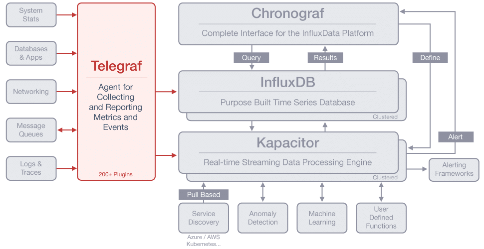

# Telegraf

Telegraf是TICK Stack的一部分，是一个插件驱动的服务器代理，用于收集和报告指标。Telegraf集成了直接从其运行的容器和系统中提取各种指标，事件和日志，从第三方API提取指标，甚至还可以通过Stats和Kafka消费者服务监听指标。它还具有输出插件，可将指标发送到各种其它数据存储，服务和消息队列，包括InfluxDB，Graphite，OpenTSDB，Datadog，Librato，Kafka，MQTT，NSQ等等。



- Telegraf是一个度量收集守护进程，它可以从广泛的输入数据中收集度量，并将它们写入广泛的输出数组中。它由插件驱动，用于收集和输出数据，因此很容易扩展。它是用Go编写的，这意味着它是一个编译后的独立二进制文件，可以在任何系统上执行，不需要外部依赖，也不需要npm、pip、gem或其他包管理工具。
- 在社区中，主题专家已经编写了超过200个关于数据的插件，因此很容易从指定端点开始收集数据。更好的是，插件开发的易用性意味着可以构建自己的插件来满足监控需求。甚至可以使用Telegraf将输入数据格式解析为度量。这些包括：InfluxDB Line Protocol，JSON，Graphite，Value，Nagios and Collectd

## 安装

```shell
# OS X
brew update
brew install telegraf

# Docker Image
docker pull telegraf

# Ubuntu & Debian
# ubuntu安装默认的配置文件 /etc/telegraf/telegraf.conf
wget https://dl.influxdata.com/telegraf/releases/telegraf_1.10.2-1_amd64.deb
sudo dpkg -i telegraf_1.10.2-1_amd64.deb

# RedHat & CentOS
wget https://dl.influxdata.com/telegraf/releases/telegraf-1.10.2-1.x86_64.rpm
sudo yum localinstall telegraf-1.10.2-1.x86_64.rpm

# Windows Binaries (64-bit)
wget https://dl.influxdata.com/telegraf/releases/telegraf-1.10.2_windows_amd64.zip
unzip telegraf-1.10.2_windows_amd64.zip
```

## 操作

```shell
telegraf --help

# 生成配置文件
telegraf config > telegraf.conf

# 生成之定义cpu输入和输出数据库插件的配置文件
telegraf --input-filter cpu --output-filter influxdb config

# 运行测试
telegraf --config telegraf.conf --test

# 运行
telegraf --config telegraf.conf

# 运行telegraf, 启用cpu和memory采集插件，以及数据库输出插件
telegraf --config telegraf.conf --input-filter cpu:mem --output-filter influxdb
```


## 数据采集插件的配置

### CPU

插件参数：

- totalcpu (boolean)：如果为true，将包含`cpu-total`数据
- precpu (boolean)：如果为true，包括基于每个cpu的cpu0、cpu1等数据。

配置格式：

```properties
[[inputs.cpu]]
# Wheter to report per-cpu stats or not
percpu = true
# Wheter to report total system cpu stats or not
totalcpu = true
# If true, collect raw CPU time metrics.
collect_cpu_time = false
# If true, compute and report the sum of all nonidle CPU states
report_active = false
# 删除的字段
fielddrop = ["usage_guest", "usage_steal"]
```

**Measurements:**

CPU Time measurements (时间相关):

Meta:

- units: CPU Time
- tags: `cpu=<cpuN> or <cpu-total>` (tag字段名"cpu"，其值可能为 cpu0、cpu1、... 或 cpu-total)

Measurement names:

- cpu_time_user
- cpu_time_system
- cpu_time_idle
- cpu_time_active  (必须通过设置  `report_active = true` 显式启用)
- cpu_time_nice
- cpu_time_iowait
- cpu_time_irq
- cpu_time_softirq
- cpu_time_steal
- cpu_time_guest
- cpu_time_guest_nice

CPU Usage Percent Measurements (使用百分比):

Meta:

- units: percent (out of 100)
- tags: `cpu=<cpuN> or <cpu-total>`

Measurement names:

- cpu_usage_user
- cpu_usage_system
- cpu_usage_idle
- cpu_usage_active (must be explicitly enabled by setting `report_active = true`)
- cpu_usage_nice
- cpu_usage_iowait
- cpu_usage_irq
- cpu_usage_softirq
- cpu_usage_steal
- cpu_usage_guest
- cpu_usage_guest_nice

### SNMP

SNMP插件从SNMP代理收集数据。

配置

```properties
[[inputs.snmp]]
  agents = [ "192.168.68.132:161", "192.168.68.133:161" ]
  timeout = "10s"
  retries = 3
  version = 2
  community = "public"
  max_repetitions = 10
  ## measurement name
  name = "snmp"
   [[inputs.snmp.field]]
     name = "host_name"
     oid = "iso.3.6.1.2.1.1.5.0"
     is_tag = true
   [[inputs.snmp.field]]
     name = "raw_idle_cpu_time"
     oid = ".1.3.6.1.4.1.2021.11.53.0"
   [[inputs.snmp.field]]
     name = "total_swap_size"
     oid = ".1.3.6.1.4.1.2021.4.3.0"
   [[inputs.snmp.field]]
     name = "total_ram_used"
     oid = ".1.3.6.1.4.1.2021.4.6.0"
   [[inputs.snmp.field]]
     name = "total_ram_free"
     oid = ".1.3.6.1.4.1.2021.4.11.0"
   [[inputs.snmp.field]]
     name = "total_size_of_the_disk"
     oid = ".1.3.6.1.4.1.2021.9.1.6.1"
```

## 应用注意

Telegraf的各插件，没有额外地址属性的设置的话，只能针对本机的数据进行采集。