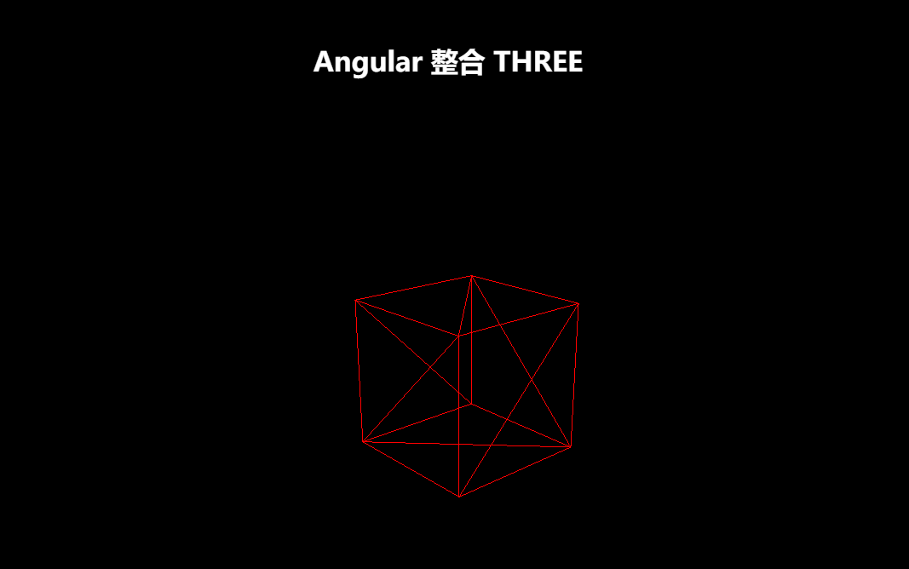

# 基于Angular使用THREEJS的简单实例

1. 通过Angular CLI命令创建Angular项目:

   ```
   ng new angular-three-demo
   ```

2. 在项目下安装three模块，及开发three使用的辅助模块@types/three:

   ```
   npm install three --save
   npm install @types/three --save-dev
   ```

3. 编辑项目下`src/app/app.component.ts`文件，需要注意以下几点:

   1. 导入THREE；
   2. AppComponent实现AfterViewInit接口，并实现ngAfterViewInit方法；

   源码如下：

   ```javascript
   import {AfterViewInit, Component} from '@angular/core';
   import * as THREE from 'three';
   
   @Component({
     selector: 'app-root',
     templateUrl: './app.component.html',
     styleUrls: ['./app.component.css']
   })
   export class AppComponent implements AfterViewInit {
   
     // 标题
     title = 'Angular 整合 THREE ';
     // 场景
     scene: THREE.Scene;
     // 相机
     camera: THREE.PerspectiveCamera;
     // 渲染器
     renderer: THREE.WebGLRenderer;
     // 几何图形
     geometry: THREE.Geometry;
     // 材料
     material: THREE.MeshBasicMaterial;
     // 几何图形+材料 构成的对象
     mesh: THREE.Mesh;
   
   
     /**
      * 视图初始化
      */
     ngAfterViewInit() {
       this.init();
       this.animate();
     }
   
     /**
      * 初始化3D视图的各个属性，构建3D视图
      */
     init() {
       this.scene = new THREE.Scene();
       this.camera = new THREE.PerspectiveCamera(
         75,
         window.innerWidth / window.innerHeight,
         1,
         10000
       );
       this.camera.position.z = 1000;
       this.geometry = new THREE.BoxGeometry(200, 200, 200);
       this.material = new THREE.MeshBasicMaterial({color: 0xff0000, wireframe: true});
       this.mesh = new THREE.Mesh(this.geometry, this.material);
       this.scene.add(this.mesh);
       this.renderer = new THREE.WebGLRenderer();
       this.renderer.setSize(window.innerWidth, window.innerHeight);
       document.body.appendChild(this.renderer.domElement);
     }
   
     /**
      * 构建3D动画
      */
     animate() {
       requestAnimationFrame(this.animate.bind(this));
       this.mesh.rotation.x += 0.01;
       this.mesh.rotation.y += 0.02;
       this.renderer.render(this.scene, this.camera);
     }
   }
   ```

4. 清空`src/app/app.component.html`的默认内容；

5. 通过Angular CLI命令启动项目;

   ```
   ng serve -o
   ```

整个demo的效果如下：



