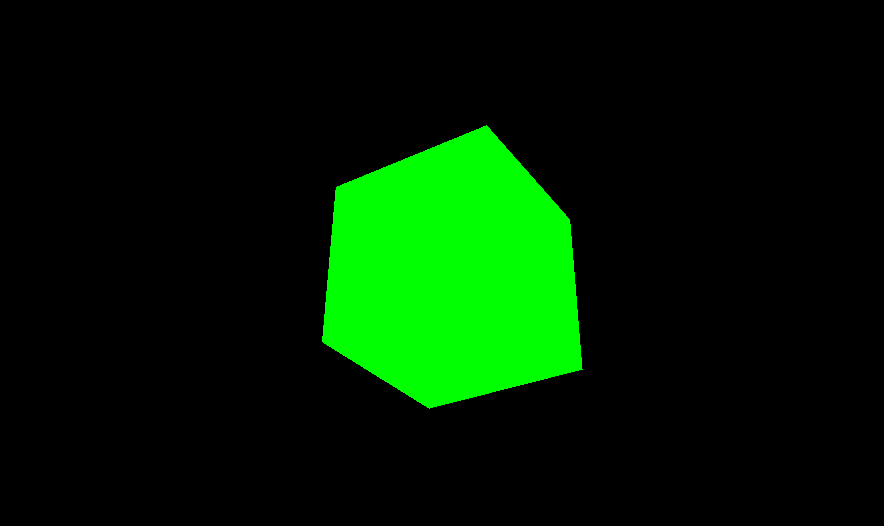
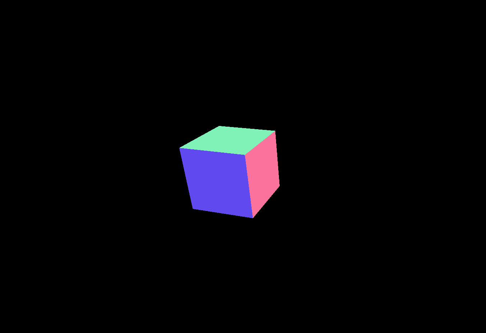
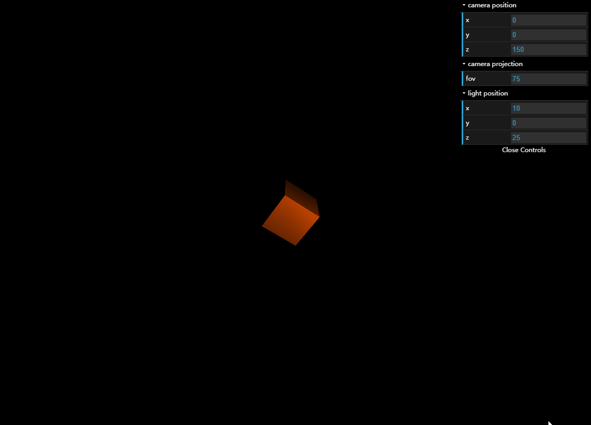

# THREE.JS 入门

threejs是一个轻量级的JavaScript3D库。该库提供`<canvas>,<svg>,CSS3D和WebGL渲染器`。

## 用法

下载[**three.js**](https://github.com/mrdoob/three.js/archive/master.zip)并将其包含在HTML中，或者将其作为模块安装和导入。

```html
<script src="js/three.min.js"></script>
```

## 官方示例

```html
<!DOCTYPE html>
<html>
    <head>
        <meta charset="UTF-8">
        <title>THREEJS</title>
        <style>
            body { margin: 0; }
            canvas { width: 100%; height: 100%; }
        </style>
    </head>
    <body>
        <script src="js/three.min.js"></script>
        <script>
            // 场景
            var scene = new THREE.Scene(); 
            /*
            相机：
            PerspectiveCamera(fov, aspect, near, far) 参数：
            fov: 垂直视野。决定了相机视图可以达到的垂直空间的大小
            aspect: 用于根据垂直方向创建水平视野的宽高比
            near: 最近的视图（摄像机视图开始的位置）
            far: 远视屏幕（摄像机视图结束的位置）
            */
            var camera = new THREE.PerspectiveCamera(75, window.innerWidth / window.innerHeight, 0.1, 1000);
            // 渲染器
            var renderer = new THREE.WebGLRenderer();
            renderer.setSize(window.innerWidth, window.innerHeight);
            // 将渲染器元素添加到HTML文档中，这是渲染器用于显示场景的<canvas>元素
            document.body.appendChild(renderer.domElement);
            
            // 创建几何图像，并为其着色
            var geometry = new THREE.BoxGeometry(1, 1, 1);
            var material = new THREE.MeshBasicMaterial({color: 0x00ff00}); // 材料
            var cube = new THREE.Mesh(geometry, material);
            // 添加到场景中
            scene.add(cube);
            
            // 默认情况下，当我们调用scene.add（）时，我们添加的东西将被添加到坐标（0,0,0）中。这会导致相机和立方体彼此在一起。为了避免这种情况，我们只需将相机移出一点。
            camera.position.z = 5;
            
            // 如果您将上面的代码复制到我们之前创建的HTML文件中，您将无法看到任何内容。这是因为我们实际上还没有渲染任何东西。为此，我们需要所谓的渲染或动画循环。
            function animate() {
                requestAnimationFrame(animate);
                cube.rotation.x += 0,01;
                cube.rotation.y += 0.01;
                renderer.render(scene, camera);
            }
            
            animate();
        </script>
    </body>
</html>
```

以上代码示例结果如下图，其效果是一个正在转动的正方体。



## 要点解析

从官方示例可以看出，根据threejs构造的3D效果分别由“场景”、“相机”、“渲染器”等几个主要元素组成的，因此分别针对threejs几个常用对象进行简要讲解。

### 场景（Scene）

场景是可以放置物体，相机及照明的3D空间。空间可以根据你的需要而变小或变大。

```javascript
// THREE.JS场景的代码
var scene = new THREE.Scene();
```

### 相机（camera）

相机模拟现实生活中胶片相机的行为。相机的位置及其面向的方向将决定场景中渲染到名目的部分。设置相机时，需要传入垂直视野（fov），纵横比，近平面和远平面。这4个值决定了相机可以捕捉的3D空间。

- fov：垂直视野。这决定了相机视图可以达到的垂直空间大小；
- aspect：用于根据垂直方向创建水平视野的宽高比；
- near：最近的视图（相机视图开始的位置）；
- far：远视平面（相机视图结束的位置）；

### 渲染器（renderer）

光有场景（scene）及相机（camera）还未能够把图像显示在屏幕上，还需要渲染器。

```javascript
// 相机和渲染器的代码
// 定义相机 THREE.PerspectiveCamera(fov, aspect, near, far)
var camera = new THREE.PerspectiveCamera(
    75,
    window.innerWidth / window.innerHeight,
    0.1,
    1000
);
// 设置相机的Z轴位置
camera.position.z = 100; 
// 定义渲染器
var renderer = new THREE.WebGLRenderer();
renderer.setSize(window.innerWidth, window.innerHeight);
// 把渲染器的元素添加到页面中
document.body.appendChild(renderer.domElement);
```

### 灯光（light）

假设把场景想象成一个带摄像头的“房间”，绝对没有光线的。如果要在房间里放置一个物体，仍然无法看到该物体。因为需要在物体上照射一下灯才能让它出现在摄像头的视野中。而且不同种类的灯，分别有不同的效果。

- 定向灯（DirectionalLight）：来自远处的大光从一个方向照射（如太阳光）；
- 环境光（AmbientLight）：较少的光源和更多的柔和色彩场景；
- 点光源（PointLight）：朝各个方向闪耀，范围有限（如灯泡）；
- 聚光灯（SpotLight）：现实生活中的聚光灯一样；
- 半球灯（HemisphereLight）：来自场景的天花板和地板的环境（非定向）灯。

**THREE.JS 使用灯光的代码**

```javascript
// 声明一个光源并设置其颜色
var light = new THREE.PoinitLight(0xFFFF00);
// 设置灯光的位置 x,y,z
light.position.set(10, 0, 25);
// 添加到场景中
scene.add(light);
```

### 几何体（geometry）

3D模型由顶点，边和面组成。

- 顶点：3条边之间的交点；
- 边：两个面相交的线；
- 面：构成模型面的多边形（三角形）；

所有3D模型都可以分解为多个小三角形多边形。你可以通过制定所有顶点位置来自己构建模型几何体，但THREE.JS的优点在于它为你提供了一组创建基本形状的方法。

**如官方示例代码里的构造几何体**

```javascript
var geometry = new THREE.BoxGeometry(1, 1, 1);
var material = new THREE.MeshBasicMaterial({color: 0x00ff00}); 
var cube = new THREE.Mesh(geometry, material);
// 添加到场景中
scene.add(cube);

// 设置其旋转角度
cube.rotation.x = 0.45;
cube.rotation.y = -0.25;
// 设置几何体在X轴上的位置
cube.position.x = -30;
```



### 材料（material）

材料指：描述对象外观的原料。就像现实生活中的物体一样，它们制成的材料决定了它们在3D世界中的表现方式。

例如示例中使用的材料：**THREE.MeshBasicMaterial()**

```javascript
var material = new THREE.MeshBasicMaterial({color: 0x00ff00}); 
```

材料接受颜色参数作为十六进制值，例如：0xffffff。THREE.JS还有一个非常方便的颜色对象来处理颜色。可以通过获取十六进制字符串，rgba字符串或hsl字符串并将其传递给颜色来创建。

```javascript
// 十六进制字符串
var color = new THREE.Color("#6f4171");
// rgba字符串
var color = new THREE.Color("rgba(188, 141, 190, 1)");
// 然后获取该颜色的十六进制值。
var hex = color.getHex();
```

THREE.JS还提供了一系列材料对象供选择，如：**THREE.MeshNormalMaterial**一种非常漂亮的彩虹色材料、**THREE.MeshLambertMaterial**一种亚光饰面材料等等。

### 动画（animate）

动画3D场景的关键是使用`requestAnimationFrame`函数创建渲染循环，并在循环内渲染场景。这意味着将立即呈现对场景所做的任何更改，从而允许通过更改对象属性来设置动画。

**如示例代码中的代码**

```javascript
function animate() {
    requestAnimationFrame(animate);
    
    cube.rotation.x += 0.01;
    cube.rotation.y += 0.01;
    
    renderer.render(scene, camera);
}
animate();
```

## 辅助工具

通过使用dat.gui，把相机、几何体、灯光等属性交给dat.gui来管理，这样就可以在页面上手动改变相机的位置，照明和视野等，以此了解它们如何影响图像的。

使用dat.gui，[下载地址](https://github.com/dataarts/dat.gui)

```javascript
<script src="js/dat.gui.min.js"></script>
```

```javascript
var gui = new dat.GUI();
var cameraGui = gui.addFolder("camera position");
cameraGui.add(camera.position, 'x');
cameraGui.add(camera.position, 'y');
cameraGui.add(camera.position, 'z');
cameraGui.open();

var cameraGui = gui.addFolder("camera projection");
cameraGui.add(camera, "fov");
cameraGui.open();

var lightGui = gui.addFolder("light position");
lightGui.add(light.position, 'x');
lightGui.add(light.position, 'y');
lightGui.add(light.position, 'z');
lightGui.open();
```



## 参考资料

- [THREE.JS Documentation](https://threejs.org/docs/index.html)
- [Beginning with 3D WebGL by Rachel Smith](https://codepen.io/rachsmith/post/beginning-with-3d-webgl-pt-1-the-scene)

