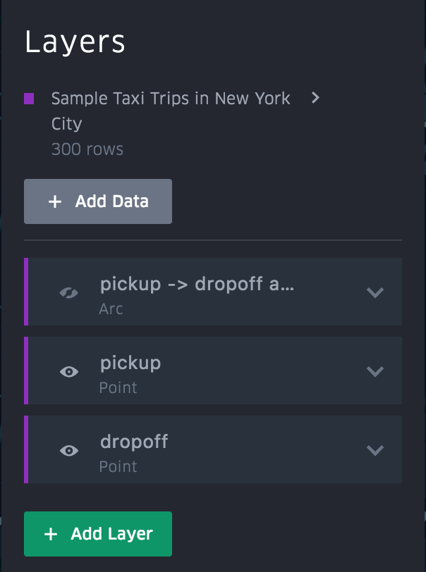
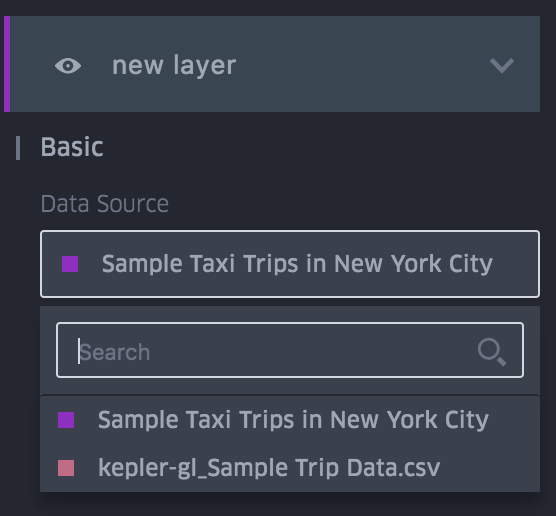
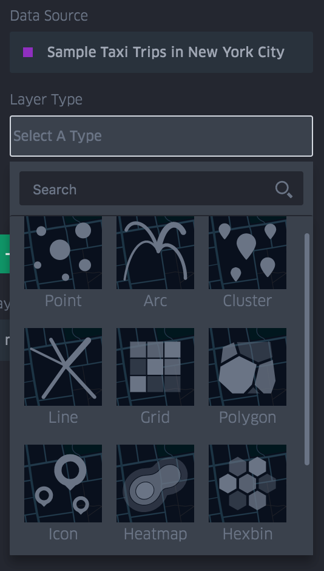

# 创建一个图层

1. 单机左侧导航栏中的“数据层”图标

   

2. "图层"面板显示现有图层的列表以及图层所属的数据集的名称（示例行程数据，在下面的示例例中）。要创建新图层，请单击菜单底部的“添加图层”。
   

3. 如果地图包含多个数据集，系统会要求你选择新图层的数据源。

4. 选择图层类型。

5. 如果需要，请填写所需的列兵调整可选设置。

6. 完成后折叠图层设置菜单。
