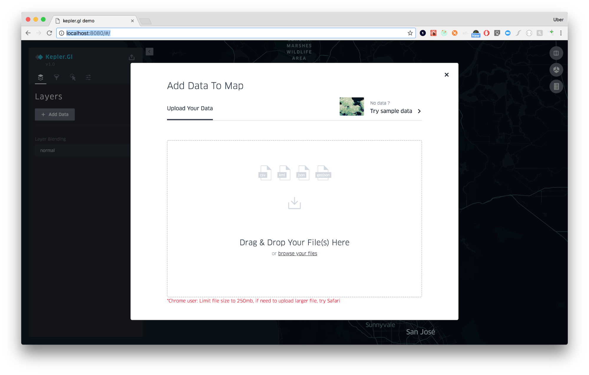
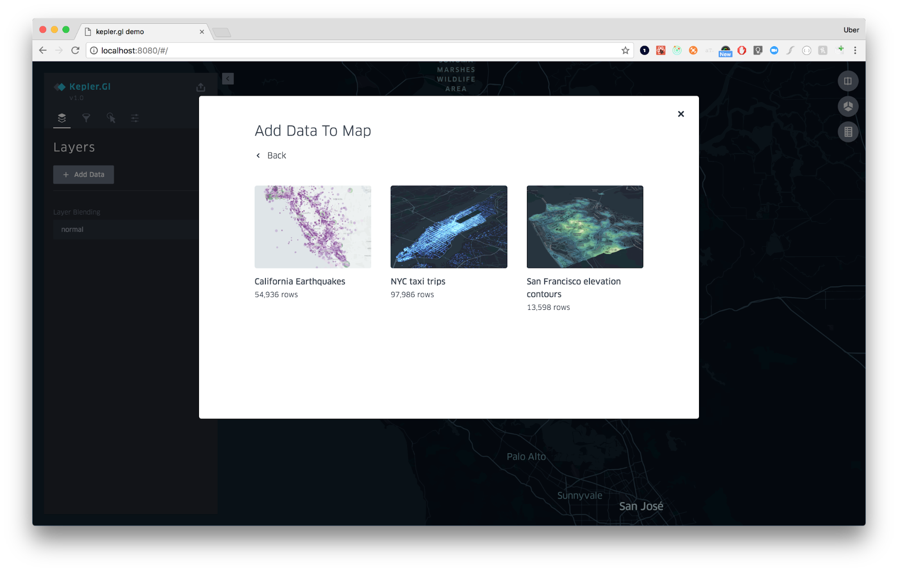
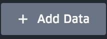

# 将数据添加到地图

## 将数据添加到地图中

1. 打开Kepler.gl。应该看到以下图示：

   

2. 选择以下两种方法之一将数据添加到地图：上传CSV / GeoJSON文件或使用Kepler.gl的样本数据集。样本数据集包括加州地震，纽约市出租车和旧金山海拔等高线。

3. Kepler.gl是一个纯粹的客户端应用程序。数据仅存在于你的计算机/浏览器上。没有信息或地图发送回我们的服务器。

## 上传CSV或GEOJSON文件

将任意数量的文件拖放到上传框中。请注意，Kepler.gl会在电子表格中查找约定，以便将图层及其设置自动填充到地图上。查看Kepler.gl的一些[示例数据集]()。

### 对于CSV文件：

- 如果要Kepler.gl创建点图层，则你的CSV要有一对列名为```<name>_lat```和```<name>_lng```或```<name>_latitude```和```<name>_longitude```，或```<name>_lat```和```<name>_lon```。仅识别小写名称。
- 如果要Kepler.gl创建弧图层，则你的CSV要有2个点的列坐标。
- 如果要Kepler.gl创建图标图层，则你的CSV要有名为```icon```的列名。
- 如果列内容包含几何数据类型，Kepler.gl会尝试从CSV文件中解析几何。可接受的格式包括[Well-Known Text](http://www.postgis.net/docs/ST_AsText.html)和[GeoJSON](http://geojson.org/)。

### 对于GeoJSON文件：

- Kepler.gl接受包含单个Feature对象或FeatureCollection对象的GeoJSON格式。Kepler.gl为每个文件创建一个图层。

- 如果FeatureCollection包含不同类型的几何，Kepler.gl将在一个图层中呈现所有几何类型。可接受的几何类型有Point，MultiPoint，LingString，MultiLineString，Polygon和MultiPolygon。

- Kepler.gl将从GeoJSON文件中读取样式。如果你是GeoJSON专家，则可以向几何属性添加样式生命。Kepler.gl将使用声明自动设置你的几何样式。可几首的样式属性是：```lineColor: [130, 154, 227]```，```lineWidth: 0.5```，```fillColor: [255, 0, 0]```，```radius: 1```，```hi-precision: true```。

- 请参阅以下示例：

  ```json
  {
      "type": "FeatureCollection",
      "features": [{
          "type": "Feature",
          "geometry": {
              "type": "MultiLineString",
              "coordinates": [
                  [
                      [-105.1547889, 39.9862516], 
                      [-105.15471672508885, 39.98626910199207]
                  ]
              ]
          },
          "properties": {
              "id": "a1398a11-d1ce-421c-bf66-a456ff525de9",
              "lineColor": [130, 154, 227],
              "hi-precision": true,
              "lineWidth": 0.1
          }
      }]
  }
  ```

### 使用Kepler.gl的样本地图

示例地图是新用户探索Kepler.gl并了解其工作原理的绝佳选择。

1. 在初始加载提示下，选择右上角的“Try sample data”。
   

2. 从加载样本图的选项中进行选择，并探索应用的配置。

   

### 添加多个数据集

要想地图添加其他数据集：

1. 点击面板上的“Add Data”选项。
   
2. 选择以上选项之一：上传JSON / CSV文件，或使用Kepler.gl的示例数据。
3. 根据需要重复。你可以添加的数据集数量没有限制。但是，添加太多可能会导致其性能受损。
