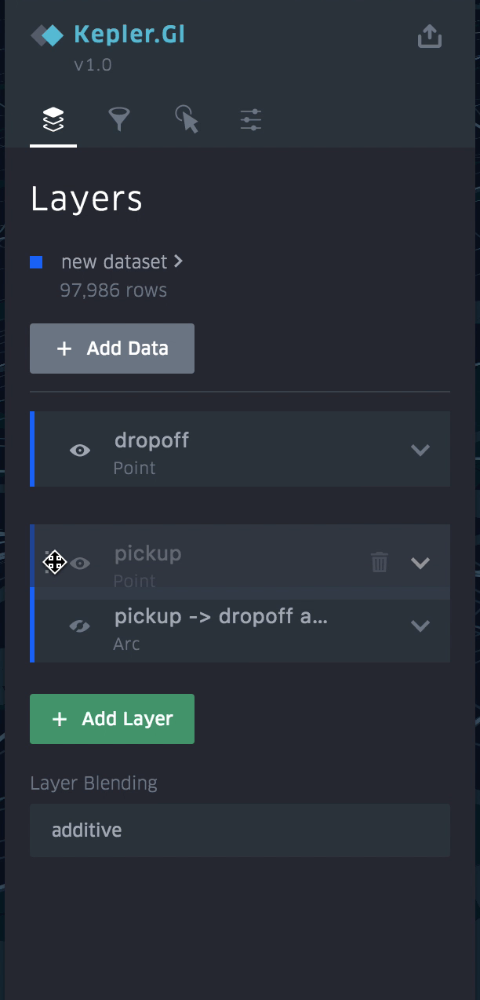
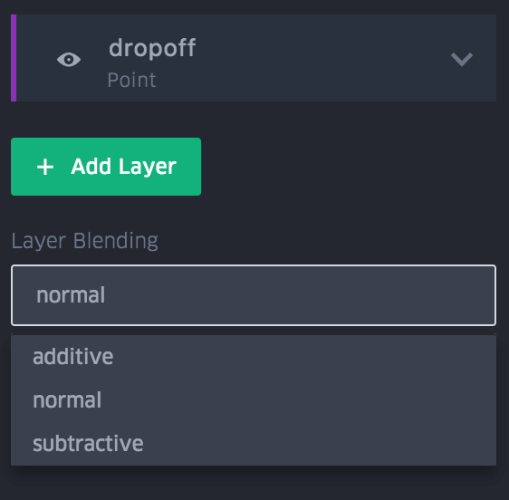
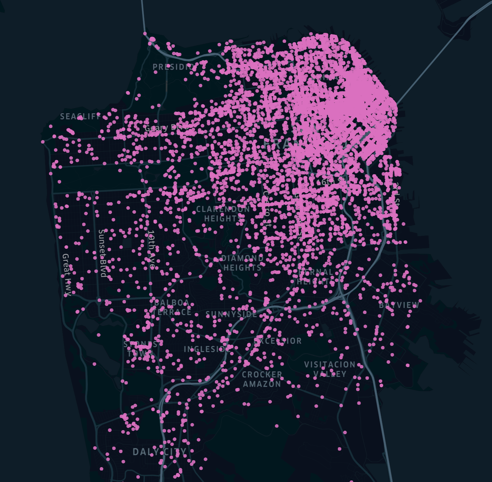
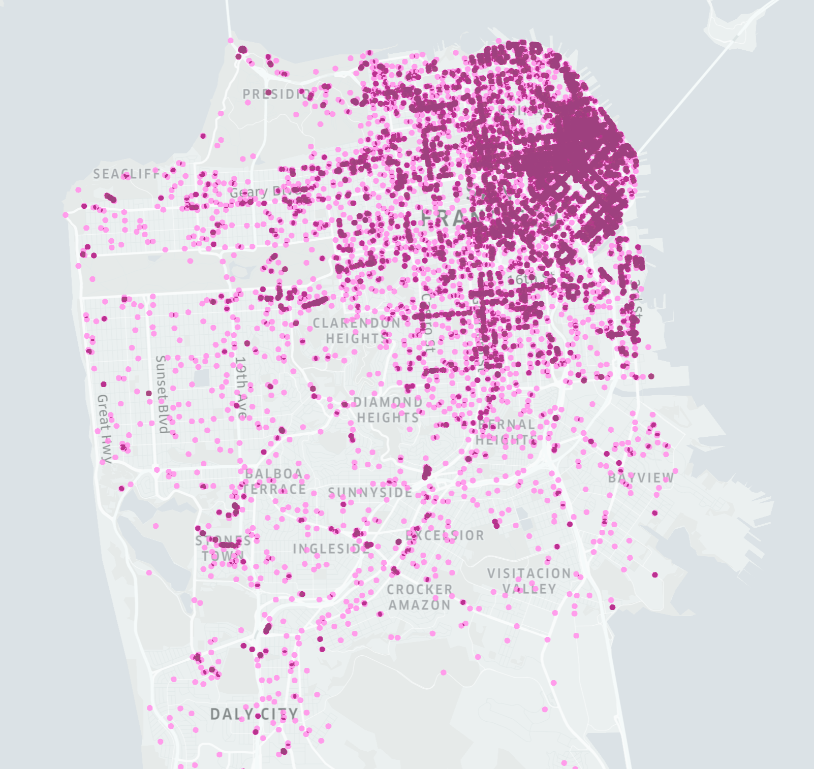

# 混合和重新排列图层

通过在"图层"面板汇总拖放图层来重新排列图层。列表顶部的图层将显示在地图的前景汇总。

通过从"图层"面板底部的下拉列表中选择一个选项来混合图层。

混合图层有三种不同的方法：正常，加色和减色。

## 正常混合

普通图层混合不会改变重叠数据点的颜色值。

## 加色混合

加色混合会为重叠数据点添加颜色值。它使图层，特别是高密度区域更容易在深色地图上可视化。

## 减色混合

减色混合图层不会改变重叠数据点的颜色值。

