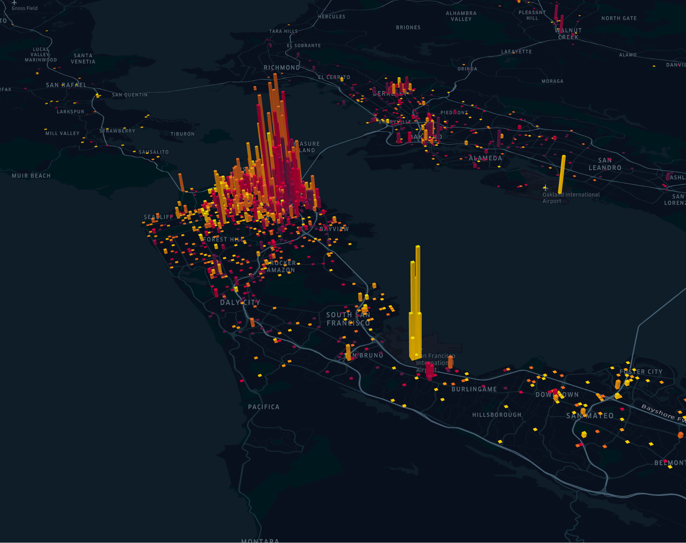

# 介绍

Kepler.gl专为地理空间数据分析而设计。它允许技术和非技术受众可视化城市或地区趋势。使用Kepler.gl，你可以在浏览器中可视化大量位置数据。随着时间的推移播放地理时间趋势。探索，过滤并深入了解位置数据，以获得洞察力。

本指南将教你如何通过向地图添加数据，创建图层，添加过滤器等来在Kepler.gl中执行数据分析。

目录：

[入门](./入门.md)

kepler.gl工作流程

- [将数据添加到地图中]()
- [添加数据层]()
- [创建一个图层]()
- [隐藏，编辑和删除图层]()
- 混合和重新排列图层

图层的类型

- [点]()
- [弧]()
- [线]()
- [格]()
- [GeoJSON]()
- [Cluster]()
- [图标]()

[图层属性]()

[过滤器]()

地图样式

- [基本地图样式]()
- [地图图层]()
- [自定义样式]()
- [在3d中查看地图]()
- [图示图例]()
- [拆分地图]()

[地图设置]()

[时间回放]()

[保存并导出]()

[常问问题]()