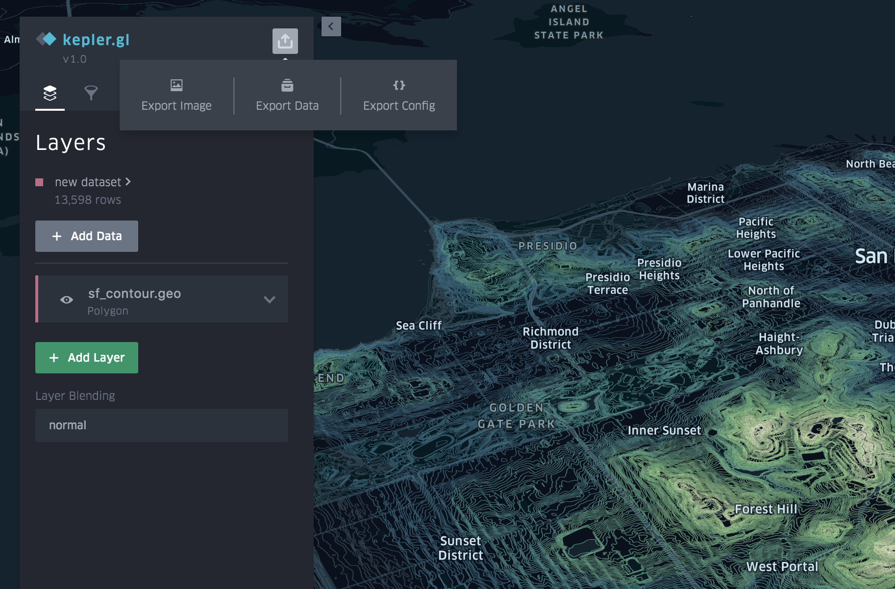
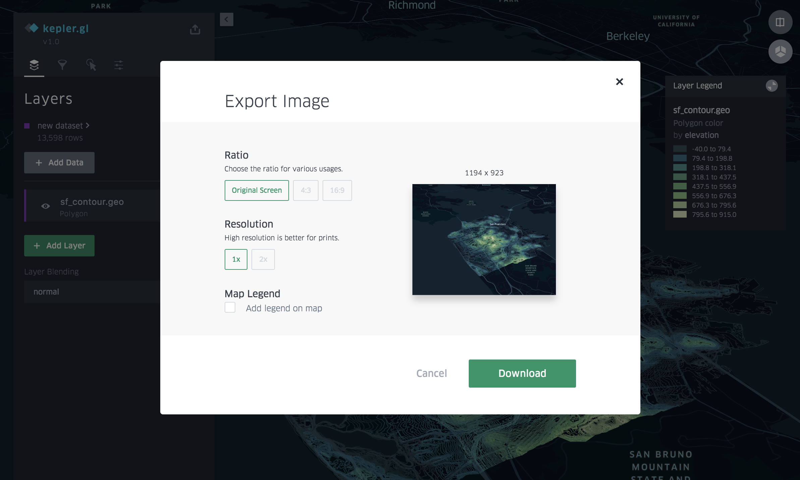
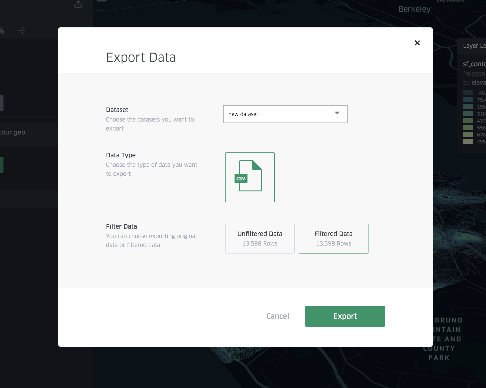
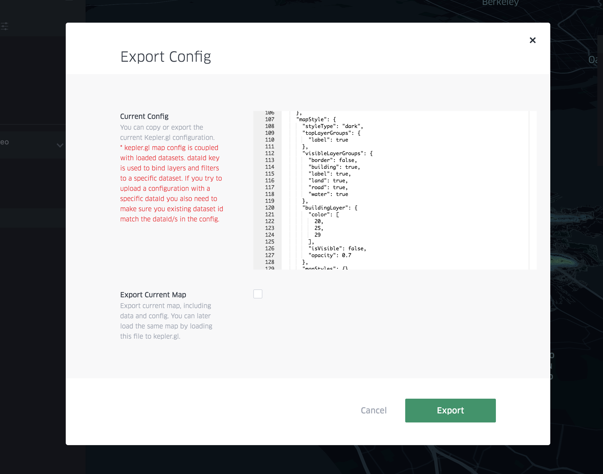

# 保存并导出

kepler.gl是一个仅限客户端的应用程序。在演示应用中，你上传的数据会保留在浏览器中。Uber不会向任何后端发送或存储任何用户数据。此规则限制了你如何保存和共享地图。

但是，在演示应用程序汇总，你可以：

- 将地图导出为图像。
- 将过滤或未过滤的数据导出为csv。
- 将当前地图配置导出为json文件，此文件不包含任何地图数据。
- 将当前地图配置和地图数据导出为json文件，可以将其加载回kepler.gl以重现当前地图。

## 导出图像

你可以将当前地图导出为图像。导出窗口将使用当前地图窗口，预览将显示整个导出的地图区域。要调整窗口，你必须关闭导出对话框。你可以选择不同的导出比率或分辨率，也可以添加地图图例。

## 导出数据

你可以将地图数据导出为csv文件，并且只能导出已过滤的数据或整个数据集。

## 导出地图配置

1. Export Current Config

   你可以将当前地图配置导出为json文件。当你运行自己的kepler.gl应用程序并希望加载具有特定预设配置的数据时，这非常有用。地图配置包括当前图层，过滤器，地图样式和交互配置。

   **注意：**kepler.gl map config与加载的数据集耦合。该dataId键用于将图层，过滤器和工具提示设置绑定到特定数据集。如果你尝试在自己的kepler.gl应用程序中上传包含数据集的配置，则还需要确保数据集id与dataId配置中的数据集匹配。

2. 保存并导出当前地图

   要保存和共享当前地图，请单击“导出当前地图”复选框，将当前配置和上传的数据导出到单个json文件中。只需将其拖放到Add Data to Map对话框中，即可将此json文件加载回kepler.gl。

