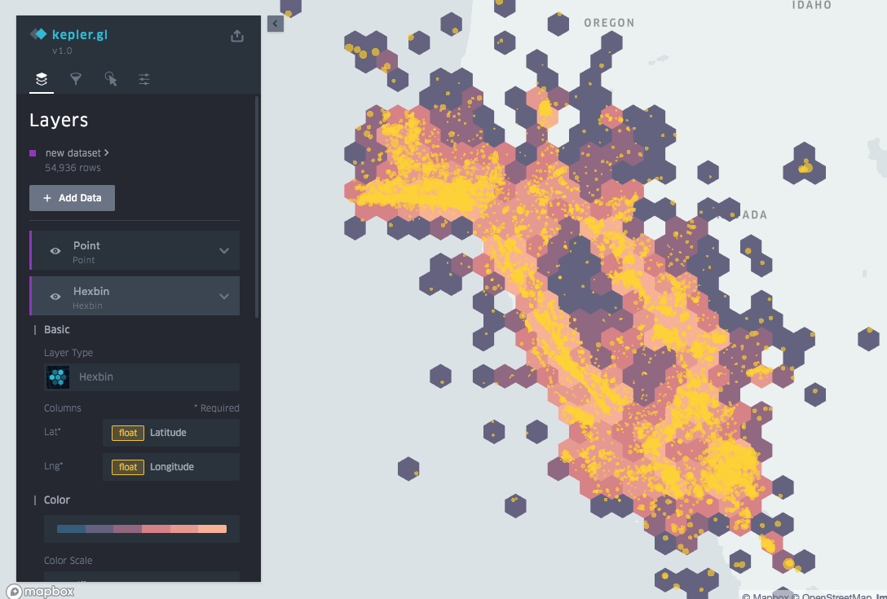
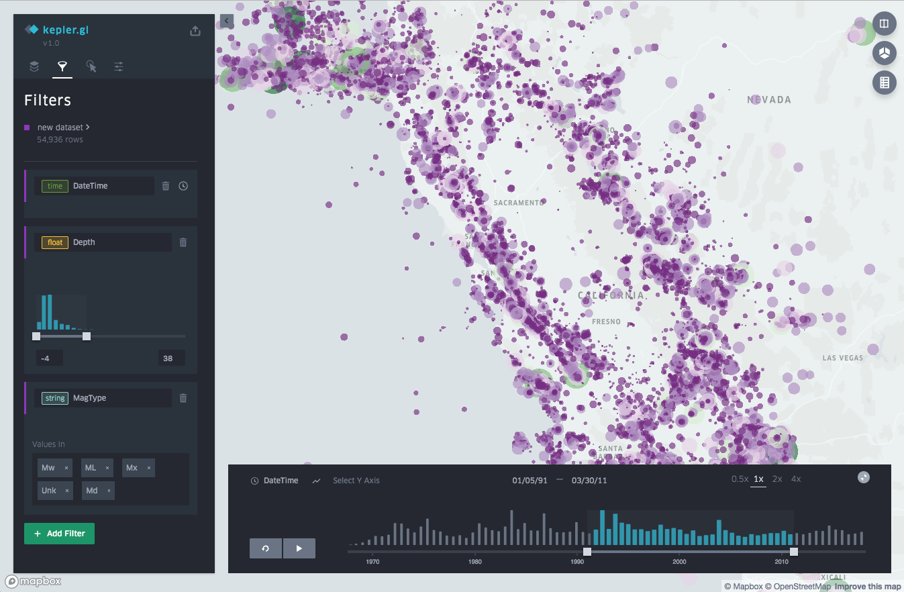
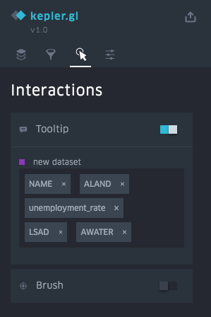
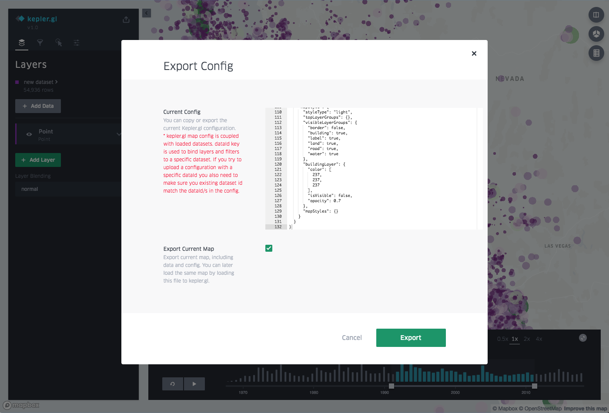

# 入门

kepler.gl是一种专为地理空间数据分析而设计的工具。

## 1）将数据添加到地图

一旦打开网页，Kepler.gl将提示你将数据添加到地图中。上传你自己的CSV或GEOJSON文件，或添加keper.gl样本数据。样本数据是探索和熟悉kepler.gl功能的好方法。

详细了解如何向[地图添加数据]()

## 2）添加图层

打开“数据层”菜单可以开始构建可视化。图层只是数据可视化，可以在皮城之上构建。上图所示的地图包含显示行程路线的GeoJSON路径图层。

如果你是kepler.gl的新手，请使用每种类型图层的不同设置。相同类型的图层在外观上可能有很大差异，具体取决于它们的配置方式，为数据分析开辟了新的可能性。

详细了解如何[添加数据图层]()

## 3）添加过滤器

向地图添加过滤器以限制显示的数据。过滤器必须基于数据集中的列。要创建新过滤器，请打开“过滤器”菜单并单击“添加过滤器”。请注意，过滤器适用于所有图层，无法打开和关闭。

详细了解[过滤器]()。

## 4）自定义地图设置

在“交互”和“基本地图”菜单中更改地图上的设置。自定义选项包括工具提示，画笔突出显示，基本地图样式，地图图像切换（水，公园，卫星图像等）等等。

了解[基本地图样式]()和[地图设置]()。

## 5）保存和导出

将地图另存为图像，导出当前地图数据，将当前地图导出为json文件已加载回kepler.gl。

了解[保存和导出]()。