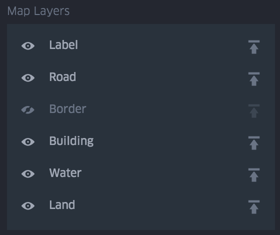

# 地图图层

地图图层切换水，建筑物，道路等。选项包括：

- 标签(Label)：显示城市，社区等的标签。
- 道路(Road)：显示半透明的道路线层。
- 边界(Border)：显示州和大陆的边界。
- 建筑物(Building)：显示建筑物的足迹。
- 水(Water)：显示水体。
- 陆地(Land)：显示公园，山脉和其他景观特征。

遥控弄直地图图像图层的显示顺序，请将移动切换到顶部图标：。

提示：在带有彩色图层的地图上将标签移动到顶部，以防止标签被隐藏。