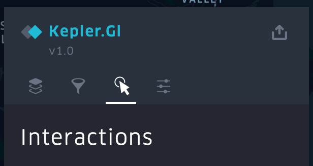
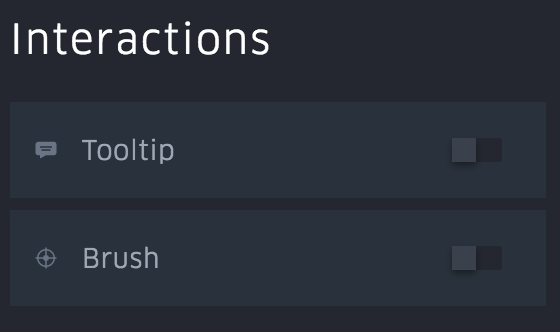
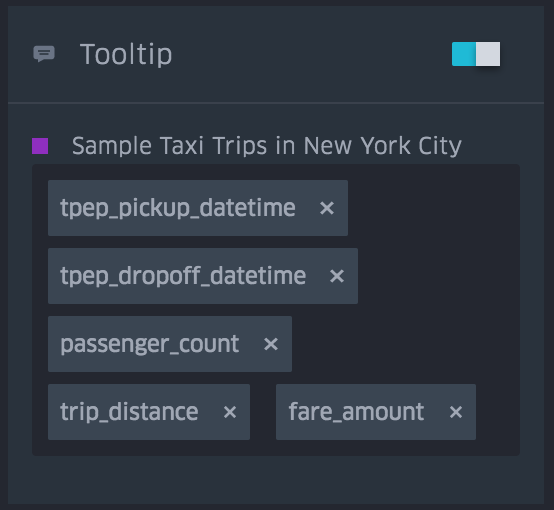
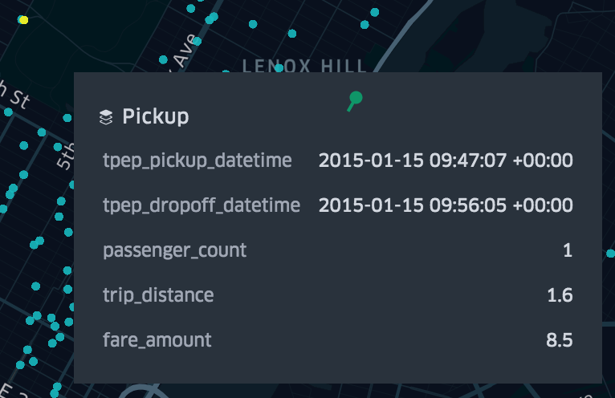

# 地图设置

你可以在地图上切换自定义选项，包括工具提示，画笔突出显示，地图图像（水，公园等）等。

## 工具提示和突出显示

要在地图上切换自定义选项：

1. 单击“交互”图标打开“交互”菜单：
2. 单击旁边要激活/取消激活的选项开关：
   有两种类型的交互可供选择：工具提示和画笔。请注意，一次只能打开一个。
   1. 工具提示：当鼠标悬停在数据点上，工具提示会显示指标。你可以从提示配置菜单中选择显示哪些字段。提示：单击一个点可以固定提示信息。要取消固定提示，请按蓝色图钉图标。
   2. 画笔：画笔允许你使用光标突出显示区域。打开画笔时，所有图层都会变暗。只有你用光标悬停的部分才会亮起。刷子特别适用于弧形层。
