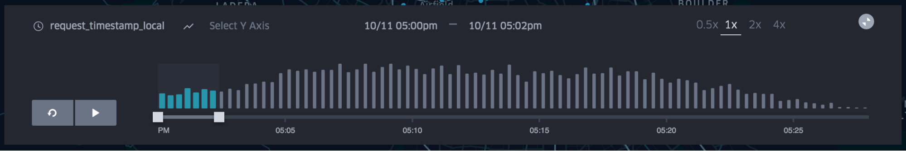
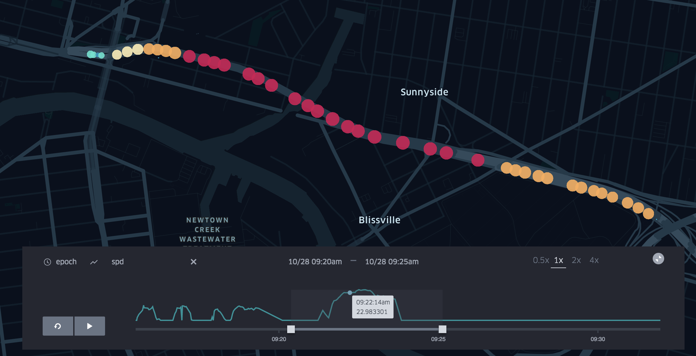

# 回放

请按照以下步骤创建事件的播放视频：

1. 添加基于时间相关字段的过滤器，如时间戳。
2. 播放窗口将显示在地图的底部。条形图是所有数据点的分布图。选择所需的滚动时间窗口：
3. 按播放即可开始播放视频。单击右上角的1x，2x，4x可更改播放速度。
4. 选择自定义y轴。你可以单击“选择Y轴”将默认分布图更改为所选列的时间。此功能的一个示例用途是显示给定行程的速度与时间关系图。

