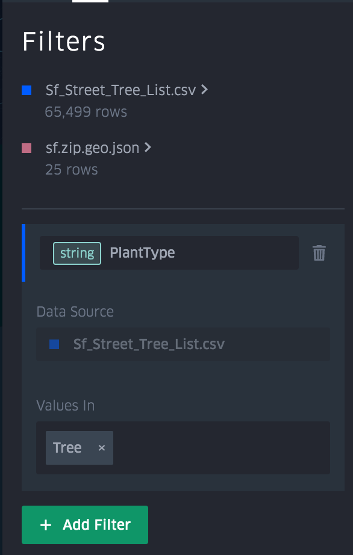

# 过滤器

向地图添加过滤器以限制显示的数据。过滤器必须基于数据集中的列。

要添加过滤器：

1. 从左侧导航栏中选择“过滤器”。
2. "过滤器"面板显示现有过滤器的列表，按数据集进行颜色编码。要创建新过滤器，请单击“添加过滤器”。
3. 选择一个数据集，然后选择要过滤数据的字段。过滤器值由字段数据类型（数组，字符串，时间戳等）定义。
4. 指定字段和值后，你的过滤器将立即应用于地图。
5. 通过单击要删除的过滤器右侧的**垃圾箱**，随时删除过滤器。

**注意：**过滤器适用于地图上统一数据集中的所有图层。