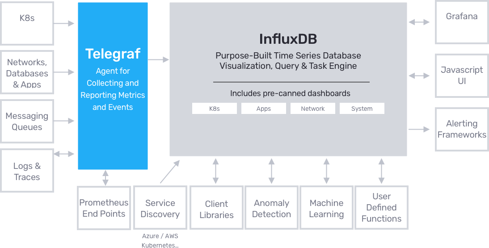
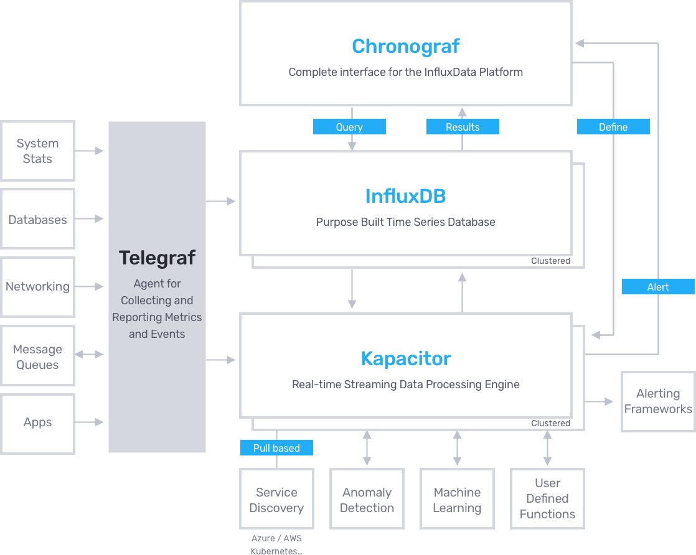
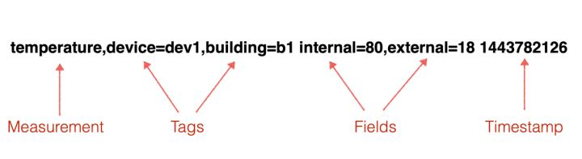
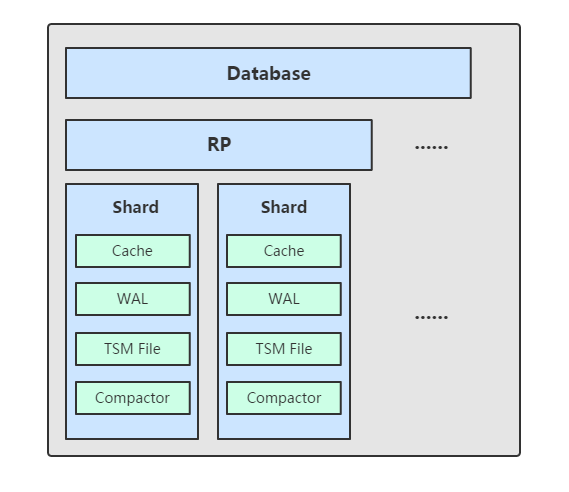

# Prometheus与InfluxDB对比分析

[TOC]

`Prometheus`是一套开源的监控系统，它不仅仅包含了时间序列数据库(`TSDB`)，还自带了抓取、检索、绘图、报警的功能。而`InfluxDB`只是一个时序型的数据库。这两个非要进行对比的话应该是`Prometheus`自带的`TSDB`与`InfluxDB`的比较，或者说`Prometheus`与除了`InfluxDB`外，还同是`InfluxData`公司出的产品`Telegraf`、`Kapacitor`、`Chronograf`一起组成的`TICK Stack`进行比较（`InfluxDB 2.0`版本把`Kapacitor`和`Chronograf`整合到了`InfluxDB`里，只留下了`Telegraf`）。而两套监控系统的视图组件，官方都推荐使用`Grafana`。

------

**`Prometheus`的体系结构图**


------

**`InfluxDB`的体系结构图（v2.0）**



------
**`InfluxDB`的体系结构图（v1.x）**



从结构图观察，可以大致的了解到`Prometheus`和`InfluxDB`它们各自的工作方式。下面通过不同的角度去分析它们各自的优劣。

## 数据采集

在数据采集方面`Prometheus`是基于`pull`的方式，而`InfluxDB`基于`push`。

首先，`Push`和`Pull`描述的是数据传输的方式，它不影响传输的内容。换言之，只要是`push`能够携带的信息，`pull`肯定也能携带同样的信息，比如“CPU利用率30%”这样的监控数据，不管是`pull`还是`push`，传输的内容还是这些，不会因为传输模式改变导致消息体积暴涨，因此两种方式消耗的网络带宽不会差别很大。

1. 发起者不同

`pull`的发起人是监控系统，它依次轮询被监控目标，所以如果目标在防火墙内或者`NAT`之后，则`pull`方式行不通。并且，对于批处理（batch）类型的任务，因为可能整个处理时间小于轮询的间隔时间，因此监控系统会捕捉不到这类任务的数据。不过为了解决这两个问题`Prometheus`提供了`pushgateway_exporter`组件来支持`push`模式的监控需求（从体系结构图中也能看到该组件）。

`push`要求发起人是被监控目标，所以它可以突破防火墙限制，即使目标躲在`NAT`之后，仍然能顺利将数据推送出来，对于批处理类型的任务也能比较从容的发出数据。

对于性能方面，不管是`push`还是`pull`，影响的只是传输方式，对传输的数据内容没有影响，占用的带宽是一样的。唯一区别是并发度可能不一样，`push`模式下，目标服务可能在某个时间内集中向监控系统推送数据，导致瞬间并发请求很大，类似`DDos`攻击，相反的，`pull`以此轮询目标服务，能够按照自己能够承受的并发度处理监控数据，避免了监控数据短时间内爆发的情况。但解决办法也有，在`push`模式下，给监控服务加上请求处理队列，超过监控系统负载的请求暂存在队列中，这样监控系统就能按照自己的节奏来处理数据，防止被队友给`DDos`。

2. 逻辑架构不同

`push`要求被监控目标知道监控系统的地址(IP或域名)，所以这部分信息需要设置在目标服务中，换言之，目标服务依赖监控系统。监控系统如果地址改变，所有目标服务都需要做响应的改动。而一旦产生依赖意味着监控系统故障，可能会影响到目标服务正常运行，当然在编程时可以做一些规避，但是逻辑上仍然是目标服务依赖监控系统。

`pull`要求监控系统知道所有目标服务的地址，目标服务对监控系统是不知情的。所以监控系统依赖目标服务，每次新增加一个目标服务，对监控系统做配置修改。从这点区别看，`pull`模式更加符合逻辑架构。这样就避免了目标服务对监控系统的依赖。因为不依赖监控系统，即使没有部署监控服务，人工判断目标服务是否正常也非常容易，只要模拟监控系统访问目标服务的某个接口即可，所以`pull`模式下的监控更像白盒，可以很轻松的获取到所有信息。相反的，`push`模式依赖于一个成型的监控服务，没有监控服务就完全不知道目标服务运行状况如何了。

3. 存在感不同

`Prometheus`把数据的采集器叫做`exporter`，如`node_exporter`运行之后在机器上占用一个端口，等待`Prometheus server`抓取数据。`InfluxDB`的数据采集器使用了`Telegraf`，官方宣传插件化驱动，通过配置文件控制插件是否开启，功能很强大。同是`Go`编写的，部署上不算难，但相对于数据采集器来说，比`exporter`的操作要多很多步骤。

`Telegraf`的默认配置文件就多达2000多行，里面包括`push`的目的地址，各种插件的控制等待，相比之下，`Prometheus`的`exporter`不需要任何配置文件，不需要任何依赖，真正的开箱即用。但`Telegraf`有一个功能很强大，它能够作为一个转发代理接收来自不同程序的消息。比如可以运行一段脚本，将结果按照一定的格式输出给`Telegraf`默认的`8186`端口，`Telegraf`再推给`InfluxDB`，这样就把一个特殊的第三方业务的数据采集起来了，不需要重启`Telegraf`，也不需要重启`InfluxDB`。

如果换用`Prometheus`，需要引入`Prometheus`的`SDK`自己编写`exporter`，而且`prometheus`会有四种指标类型，编写完之后需要去`Prometheus server`重新配置要抓取的目标，整个下来是比`Telegraf`麻烦一些的。

## 数据存储

在数据存储方面，`Prometheus`与`InfluxDB`一样，数据模型都采用键值对作为标签。此外，`InfluxDB`还有第二级标签作为字段。`InfluxDB`支持的时间戳精度高达纳秒级别，以及支持的数据类型有`float64`、`int64`、`bool`和字符串。相比之下，`Prometheus`支持的时间戳精度仅达到毫秒级别，而数据类型是`float64`，对字符串的支持有限。

`Prometheus`提供了本地存储，即`TSDB`时序数据库，本地存储给`Prometheus`带来了简单高效的使用体验，`Prometheus2.0`以后压缩数据能力也得到了很大的提升。可以在单节点的情况下满足大部分用户的监控需求。

但本地存储也限制了`Prometheus`的可扩展性，带来了数据持久化等一系列的问题。为了解决单节点存储的限制，`Prometheus`没有自己实现集群存储，而是提供了远程读写的接口，让用户自己选择合适的时序数据库来实现`Prometheus`的扩展性。

### Prometheus的存储原理

`Prometheus`按2小时一个`block`进行存储，每个`block`由一个目录组成，该目录里包含：一个或多个`chunk`文件（保存`timeseries`数据）、一个`metadata`文件、一个`index`文件（索引，通过`metric name`和`labels`查找`timeseries`数据在`chunk`文件的位置）。

最新写入的数据保存在内存`block`中，达到2小时后写入磁盘。为了防止程序崩溃导致数据丢失，实现了`WAL(WRITE-AHEAD-LOG)`机制，启动时会以写入日志(`WAL`)的方式来实现重播，从而恢复数据。

删除数据时，删除条目会记录在独立的`tombstone`文件中，而不是立即从`chunk`文件删除。

通过时间窗口的形式保存所有的样本数据，可以明显提高`Prometheus`的查询效率，当查询一段时间范围内的所有样本数据时，只需要简单的从落在该范围内的块中查询数据即可。

这些2小时的`block`会在后台压缩成更大的`block`，数据压缩合并成更高`level`的`block`文件后删除低`level`的`block`文件。这个和`leveldb`、`rocksdb`等`LSM`树的思路一致。

这些设计和`Gorilla`的设计高度相似，所以`Prometheus`几乎就是等于一个缓存`TSDB`。它本地存储的特点决定了它不能用于`long-term`数据存储，只能用于短期窗口的`timeseries`数据保存和查询。

`Prometheus`保存块数据的目录结构：

```
./data 
   |- 01BKGV7JBM69T2G1BGBGM6KB12
      |- meta.json
      |- wal
        |- 000002
        |- 000001
   |- 01BKGTZQ1SYQJTR4PB43C8PD98
      |- meta.json
      |- index
      |- chunks
        |- 000001
      |- tombstones
   |- 01BKGTZQ1HHWHV8FBJXW1Y3W0K
      |- meta.json
      |- wal
        |-000001
```


### InfluxDB的存储原理

1. **数据格式**

在`InfluxDB`中，我们可以粗略的将要存入的一条数据看作一个虚拟的`key`和其对应的`value(field value)`，格式如下：



虚拟的`key`包括以下几个部分：`database`，`retention policy`，`measurement`，`tag sets`，`field name`，`timestamp`。`database`和`retention policy`在上面的数据中并没有体现，通常在插入数据时在`http`请求的相应字段中指定。

- **database**：数据库名，在`InfluxDB`中可以创建多个数据库，不同数据库中的数据文件是隔离存放的，存放在磁盘上的不同目录。
- **retention policy**：存储策略，用于设置数据保留的时间，每个数据库刚开始会自动创建一个默认的存储策略`autogen`，数据保留时间为永久，之后用户可以自己设置，例如保留最近2小时的数据。插入和查询数据时如果不指定存储策略，则使用默认存储策略，且默认存储策略可以修改。`InfluxDB`会定期清楚过期的数据。
- **measurement**：测量指标名（可理解为传统数据库里的表名），例如`temperature`表示温度。
- **tag sets**：`tags`在`InfluxDB`中会按照字典序排序，不管`tagk`还是`tagv`，只要不一致就分别属于两个`key`。
- **tag**：标签，在`InfluxDB`中，`tag`是要给非常重要的部分，`measurement`+`tag`一起作为数据库的索引，是`key-value`的形式。
- **field name**：例如上面数据中的`value`就是`filedName`，`InfluxDB`中支持一条数据插入多个`filedName`，这其实时一个语法上的优化，在实际的底层存储中，是当作多条数据来存储。
- **timestamp**：每一条数据都需要指定一个时间戳，在`TSM`存储引擎中会特殊对待，为了优化后续的查询操作。

2. **Point**

`Point`由时间戳（`time`）、数据（`fileds`）、标签（`tags`）组成，`point`相当于传统数据库里的一行数据。

| Point属性 | 传统数据库中的概念                               |
| --------- | ------------------------------------------------ |
| time      | 每个数据记录时间，是数据库中的主索引（自动生成） |
| tags      | 各种由索引的属性                                 |
| fields    | 各种记录值（没有索引的属性）                     |

3. **Series**

`Series`相当于`InfluxDB`中一些数据的集合，在同一个`database`中，`retention policy`、`measurement`、`tag sets`完全相同的数据同属于一个`series`，同一个`series`的数据在物理上会按照时间顺序排列存储在一起。

4. **Shard**

`Shard`在`InfluxDB`中是要给比较重要的该你那，它和`retention policy`相关联。每一个存储策略下会存在许多`shard`，每一个`shard`存储一个指定时间段内的数据，并且不重复，例如7点-8点的数据落入`shard0`中，8点-9点的数据则落入`shard1`中。每一个`shard`都对应一个底层的`TSM`存储引擎，有独立的`cache`、`wal`、`tsm file`。

5. **组件**

`TSM`存储引擎主要由几个部分组成：`cache`、`wal`、`tsm file`、`compactor`



- **Cache**：`cache`相当于是`LSM Tree`中的`memtabl`。插入数据时，实际上是同时往`cache`与`wal`中写入数据，可以认为`cache`是`wal`文件中的数据在内存中的缓存。当`InfluxDB`启动时，会遍历所有的`wal`文件，重新构造`cache`，这样即使系统出现故障，也不会导致数据的丢失。
  `cache`中的数据并不是无限增长的，有一个`maxSize`参数用于控制当`cache`中的数据占用多少内存后就会将数据写入`tsm`文件。如果不配置的话，默认上限为`25MB`，每当`cache`中的数据达到阈值后，会将当前的`cache`进行一次快照，之后清空当前`cache`中的内容，再创建一个新的`wal`文件用于写入，剩下的`wal`文件最后会被删除，快照中的数据会经过排序写入一个新的`tsm`文件中。
- **WAL**：`wal`文件的内容与内存中的`cache`相同，其作用就是为了持久化数据，当系统崩溃后可以通过`wal`文件恢复还没有写入到`tsm`文件中的数据。
- **TSM File**：单个`tsm file`大小最大为`2GB`，用于存放数据。
- **Compactor**：`compactor`组件再后台持续运行，每隔1秒回检查一次是否由需要压缩合并的数据。
  主要进行两种操作，一种是`cache`中的数据大小达到阈值后，进行快照，之后转存到一个新的`tsm`文件中。
  另一种就是合并当前的`tsm`文件，将多个小的`tsm`文件合并成一个，使没有给文件尽量达到单个文件的最大大小，减少文件的数量，并且一些数据的删除操作也是再这个时候完成。

## 数据查询

在数据查询上面，作为基本的时间序列数据库，两者对数据的基本获取都很简单。`InfluxDB`的查询语言`InfluxQL`与`SQL`类似，但是不能像`SQL`那样做强大的表与表之家的操作。`Prometheus`的查询语言`PromQL`也很有特点，而且通过它可以实现各种强大的查询操作。

1. 基本的查询

```sql
# InfluxDB:
SELECT mean("value") FROM "disk_io_time" WHERE $timeFilter GROUP BY time($interval), "instance" fill(null)
```

```
# Prometheus:
disk_io_time
```

2. 基本的算术计算

```sql
# InfluxDB:
SELECT mean("value") * 1024 FROM "disk_io_time" WHERE $timeFilter GROUP BY time($interval), "instance" fill(null)
```

```
# Prometheus:
disk_io_time * 1024
```

3. 计算速度

```sql
# InfluxDB:
SELECT derivative(mean("value"), 10s) * 1024 FROM "disk_io_time" WHERE $timeFilter GROUP BY time($interval), "instance" fill(null)
```

```
# Prometheus:
rate(disk_io_time) * 1024
```

4. 查询1分钟内`CPU`使用率

```sql
# InfluxDB:
SELECT 100 - usage_idel FROM "autogen"."cpu" WHERE time > now() - 1m and "cpu"='cpu0'
```

```
# Prometheus:
100 - (node_cpu{job="node",mode="idle"}[1m])
```

可以看出在数据查询上`Prometheus`的查询语句要比`InfluxDB`简略很多。

## 高可用与集群功能

`InfluxDB`的集群功能在`0.11`版本之后把集群功能商业化，同时在`0.12`版本也公开了`influxdb-relay`套件，用来实现`influxdb`的高可用。`Influxdb-relay`在`InfluxDB`上面加了一层作为转发代理，数据经过代理后分发到各个数据库实例上。但仅支持`write`和`UDP`请求的处理，而`query`请求则是直接访问`influxdb`。

`Prometheus`的本地存储给`Prometheus`带来了简单高效的使用体验，可以让`Promethues`在单节点的情况下满足大部分用户的监控需求。但是本地存储也同时限制了`Prometheus`的可扩展性，带来了数据持久化等一系列的问题。通过`Prometheus`的`Remote Storage`特性可以解决这一系列问题，包括`Promethues`的动态扩展，以及历史数据的存储。

而除了数据持久化问题以外，影响`Promethues`性能表现的另外一个重要因素就是数据采集任务量，以及单台`Promethues`能够处理的时间序列数。因此当监控规模大到`Promethues`单台无法有效处理的情况下，可以选择利用`Promethues`的联邦集群特性，将`Promethues`的监控任务划分到不同的实例当中。

### 关于Promethues的远端存储

`Promethues`的本地存储设计可以减少其自身运维和管理的复杂度，同时能够满足大部分用户监控规模的需求。但是本地存储也意味着`Promethues`无法持久化数据，无法存储大量历史数据，同时也无法灵活扩展。

为了保持`Promethues`的简单性，`Promethues`并没有尝试在自身中解决以上问题，而是通过定义两个标准接口(`remote_write/remote_read`)，让用户可以基于这两个接口对接任意第三方的存储服务，这种方式在`Promethues`中成为`Remote Storage`。

**Remote Write**

用户可以在`Promethues`配置文件中指定`Remote Write`(远程写)的`URL`地址，一旦设置了该配置项，`Promethues`将样本数据通过`HTTP`的形式发送给适配器(`Adaptor`)。而用户则可以在适配器中对接外部任意的服务。外部服务可以是真正的存储系统，也可以是消息队列等任意形式。

**Remote Read**

`Promethues`的`Remote Read`(远程读)也通过了一个适配器实现。在远程读的流程当中，当用户发起查询请求后，`Promethues`将向`remote_read`中配置的`URL`发起查询请求（`matchers`,`ranges`），适配器根据请求条件从第三方存储服务中获取响应的数据。同时将数据转换为`Promethues`的原始样本数据返回给`Promethues Server`。当获取样本数据后，`Promethues`在本地使用`PromQL`对样本数据进行二次处理。

目前`Promethues`社区也提供了部分对于第三方数据库的`Remote Storage`支持：

| 存储服务    | 支持模式   |
| ----------- | ---------- |
| AppOptics   | write      |
| Chronix     | write      |
| Cortex      | read/write |
| CrateDB     | read/write |
| Gnocchi     | write      |
| Graphite    | write      |
| InfluxDB    | read/write |
| OpenTSDB    | write      |
| PostgreSQL  | read/write |
| TimescaleDB | read/write |
| SignalFx    | write      |

## 总结

### Prometheus的特点

`Promethues`是一个开源的完整监控解决方案，其对传统监控系统的测试和告警模型进行了彻底的颠覆，形成了基于中央化的规则计算、统一分析和告警的新模型。相比于传统监控系统`Prometheus`具有以下优势：

- **易于管理**：`Prometheus`核心部分只有一个单独的二进制文件，不存在任何的第三方依赖（数据库，缓存等）。唯一需要的就是本地磁盘，因此不会由潜在的级联故障风险。`promethues`基于`PULL`模型的架构方式，可以在任何地方搭建监控系统。对于一些复杂的情况，还可以使用`Prometheus`服务发现（Service Discovery）的能力动态管理监控目标。
- **监控服务的内部运行状态**：`Promethues`鼓励用户缉拿空服务的内部状态，基于`Prometheus`丰富的`Client`库，用户可以轻松的在应用程序中添加对`Prometheus`的支持，从而让用户可以获取服务和应用内部真正的状态。
- **强大的数据模型**：所有采集的监控数据均以指标（`metric`）的形式保存在内置的时间序列数据库当中（`TSDB`）。所有的样本除了基本的指标名称外，还包含一组用于描述该样本特征的标签。
- **强大的查询语言PromQL**：`Prometheus`内置了一个强大的数据查询语言`PromQL`。通过`PromQL`可以实现对监控数据的查询、聚合。同时`PromQL`也被应用于数据可视化（如`Grafana`）以及告警当中。
- **高效**：对于监控系统而言，大量的监控任务必然导致由大量的数据产生。而`Prometheus`可以高效地处理这些数据，对于单一`Prometheus Server`实例而言它可以处理：
  - 数以百万的监控指标
  - 每秒处理数十万的数据点。
- **可扩展**：`Prometheus`可以在每个数据中心、每个团队运行独立的`Prometheus Server`。`Promethues`对于联邦集群的支持，可以让多个`Promethues`实例产生一个逻辑集群，当单实例`Promethues Server`处理的任务量过大时，通过使用功能分区(`sharding`)+联邦集群(`federation`)可以对其进行扩展。
- **易于集成**：使用`Prometheus`可以快速搭建监控服务，并且可以非常方便地在应用程序中进行集成。目前支持： `Java`， `JMX`， `Python`， `Go`，`Ruby`，` .Net`， `Node.js`等等语言的客户端`SDK`，基于这些`SDK`可以快速让应用程序纳入到Prometheus的监控当中，或者开发自己的监控数据收集程序。

### InfluxDB的特点

`InfluxDB`是一个时间序列数据库，旨在处理高写入和查询负载。它是`TICK`堆栈的组成部分。`InfluxDB`旨在用作涉及大量带时间戳数据的任何用例的后备存储，包括`DevOps`监控，应用程序指标，物联网传感器数据和实时分析。主要特点如下：

- 专为时间序列数据编写的自定义高性能数据存储。`TSM`引擎允许高速摄取和数据压缩；
- 完全由`Go`语言编写，它编译成要给没有外部依赖关系的二进制文件；
- 拥有简单及高性能写入和查询的`HTTP API`；
- 为方便查询聚合数据而定制了类`SQL`语言；
- 标签允许对序列进行索引，以实现快速的有效查询；
- 保留策略可自动的删除过期数据；
- 连续查询自动计算聚合数据，以提高频繁查询的效率。

目前`InfluxDB`的最新版本为`2.0.0 Alpha 15`（2019年7月11日发布）。`2.0`版本与`1.x`版本有很大的区别，原先在`1.x`版本的`TICK Stack`中的`I`,`C`,`K`已被整合为单个二进制文件，因此在`2.0`版本仅剩下`InfluxDB`和`Telegraf`。虽然相对于`1.x`版本功能更强大了，但目前还处于`Alpha`版本，而且`InfluxDB`若想使用原生的集群扩展还得花钱使用企业版。

**所以经过分析，可使用`Promethues`作为监控系统数据的主要处理，而通过扩展使用`InfluxDB`作为其远程存储的数据库达到数据持久化处理。**

------

**参考文章：**

> - [InfluxDB与Prometheus用于监控系统上的对比](https://www.jianshu.com/p/d666ee3147d2)
> - [Prometheus VS InfluxDB](https://my.oschina.net/xiaominmin/blog/1788533)
> - [prometheus远程存储之influxdb和timescaledb对比测试](https://my.oschina.net/sannychan/blog/3072922)
> - [Prometheus高可用(1)：理解本地存储](http://ylzheng.com/2018/03/06/promethus-local-storage/)
> - [Prometheus高可用(2)：理解远端存储](http://ylzheng.com/2018/03/07/promethues-remote-storage/)
> - [Prometheus高可用(3)：联邦集群](http://ylzheng.com/2018/03/08/prometheus-fedreation/)
> - [prometheus 使用influxdb 做永久存储](http://chenzhijun.me/2018/06/09/prometheus-storage-influxdb/)
> - [容器监控实践—Prometheus存储机制](https://segmentfault.com/a/1190000018479963)
> - [Prometheus TSDB总纲](https://zhuanlan.zhihu.com/p/59691668)
> - [InfluxDB基本概念和操作](https://www.cnblogs.com/shhnwangjian/p/6897216.html)
> - [时序数据库连载系列: 时序数据库一哥InfluxDB之存储机制解析](https://zhuanlan.zhihu.com/p/57119093)
> - [Influxdb原理详解](https://www.linuxdaxue.com/influxdb-principle.html)
> - [prometheus-book](https://yunlzheng.gitbook.io/prometheus-book/)

